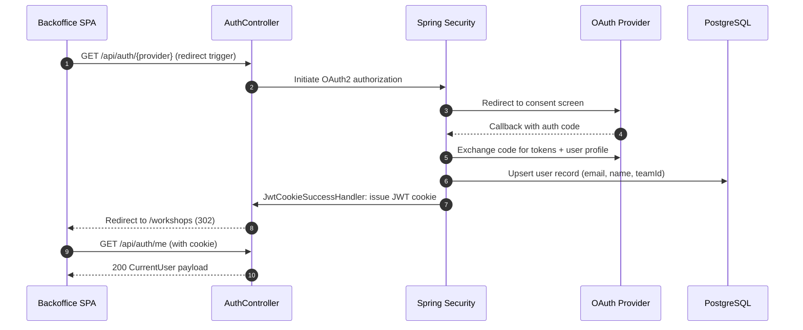
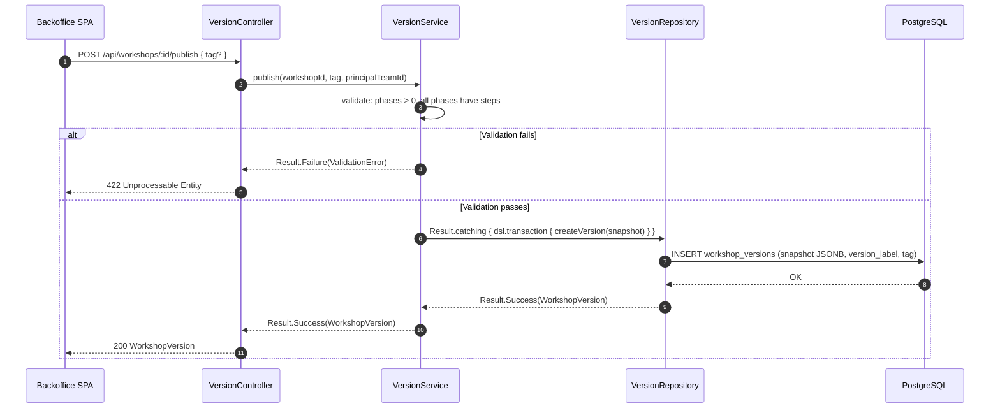
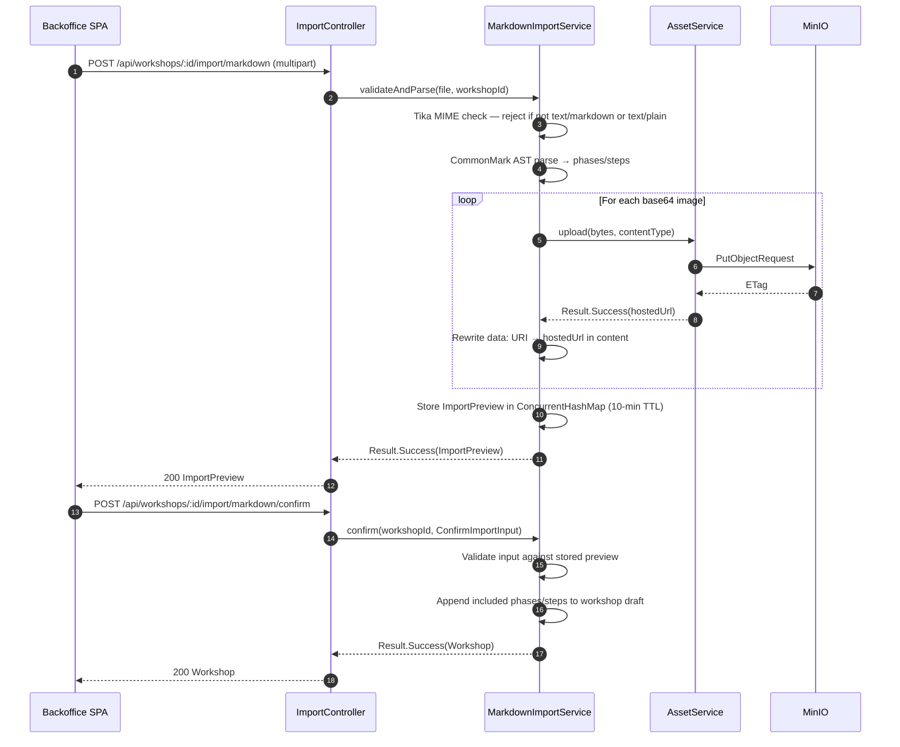
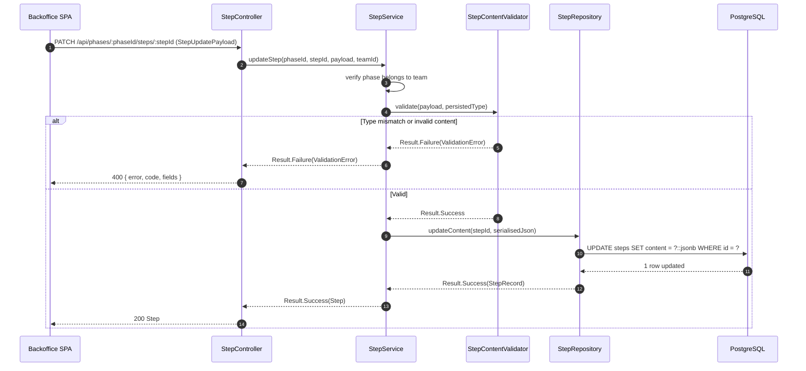

# Design Document — Backoffice Backend API

## Overview

The Backoffice Backend API delivers the server-side foundation for the Stageboard platform's content-authoring workflow.
It exposes the REST contracts defined in `.kiro/specs/backoffice-content-authoring/design.md` and persists all workshop
content (workshops, phases, steps, versions, locks) to PostgreSQL.

The service is a Spring Boot 4.x MVC application written in Kotlin. All fallible operations return `Result<T>` from the
existing `io.stageboard.spellbook.common.model` infrastructure; no exception is used as primary control flow.
Authentication is handled entirely server-side via Spring Security OAuth2/OIDC (Google, GitHub, X/Twitter) and an
email-password path, issuing httpOnly JWT cookies.

The design prioritises functional composition (`map`, `flatMap`, `fold`) over class inheritance, immutable `data class`
domain objects, and explicit transaction boundaries via jOOQ's `DSLContext.transaction { }` wrapped in `Result.catching`.

### Goals

- Implement all REST endpoints defined in the frontend design spec with exact method, path, and status-code fidelity.
- Enforce team-scoped data isolation at the service layer using the authenticated principal's `teamId`.
- Provide atomic multi-step database operations (publish, move, reorder, restore, cascade delete) via jOOQ transactions.
- Expose a structured error JSON contract aligned with `DomainError` subtypes.
- Handle Markdown import with base64 image extraction and MinIO asset upload.

### Non-Goals

- WebFlux / Reactor / Coroutines in the API layer (C-08).
- JPA/Hibernate annotations (C-06).
- Notion import (C-05).
- Refresh token rotation (OQ-5 deferred — 24h fixed expiry only).
- Rate limiting on auth endpoints (OQ-6 deferred — out of scope for this phase).
- Horizontal scaling / sticky-session infrastructure (single-instance assumption for this phase).

---

## Architecture

### Existing Architecture Analysis

The existing codebase provides `io.stageboard.spellbook.common.model.Result<T>` (sealed `Success`/`Failure`) and
`io.stageboard.spellbook.common.model.DomainError` (sealed `DatabaseError` / `ValidationError` / `NotFoundError` /
`UnexpectedError` / `StateError`). These must be imported and used as-is; no redesign or duplication is permitted.

The steering document `backend.md` mandates the exact layer boundary:

```
Controller  →  Service  →  Repository  →  Database
    ↕              ↕
  DTO            Domain
```

### Architecture Pattern & Boundary Map

The service follows the **Layered Architecture** pattern with strict package boundaries per domain area.

```mermaid
graph TB
    subgraph API[Spring MVC API Layer]
        AuthCtrl[AuthController]
        WorkshopCtrl[WorkshopController]
        PhaseCtrl[PhaseController]
        StepCtrl[StepController]
        LockCtrl[LockController]
        VersionCtrl[VersionController]
        ImportCtrl[ImportController]
    end

    subgraph Service[Service Layer]
        AuthSvc[AuthService]
        WorkshopSvc[WorkshopService]
        PhaseSvc[PhaseService]
        StepSvc[StepService]
        LockSvc[LockService]
        VersionSvc[VersionService]
        ImportSvc[MarkdownImportService]
        AssetSvc[AssetService]
    end

    subgraph Repository[Repository Layer]
        UserRepo[UserRepository]
        WorkshopRepo[WorkshopRepository]
        PhaseRepo[PhaseRepository]
        StepRepo[StepRepository]
        LockRepo[LockRepository]
        VersionRepo[VersionRepository]
    end

    subgraph Infra[Infrastructure]
        DSL[jOOQ DSLContext]
        S3[S3Client MinIO]
        Security[Spring Security]
        JWT[JwtEncoder / JwtDecoder]
    end

    subgraph DB[PostgreSQL]
        Tables[(Tables)]
    end

    subgraph External[External OAuth Providers]
        Google[Google OIDC]
        GitHub[GitHub OAuth2]
        XTwitter[X OAuth2]
    end

    API --> Service
    Service --> Repository
    Repository --> DSL
    DSL --> Tables
    ImportSvc --> AssetSvc
    AssetSvc --> S3
    AuthSvc --> Security
    Security --> JWT
    Security --> Google
    Security --> GitHub
    Security --> XTwitter
    ResultExt[Result.toResponseEntity\(\)]
    ResultExt --> API
```

**Architecture Integration**:

- Selected pattern: Layered — Controller converts `Result<T>` to `ResponseEntity`; Service owns business logic; Repository wraps all DB calls in `Result.catching { }`.
- Domain boundaries: each domain area (workshop, phase, step, lock, version, import) has its own controller, service, and repository.
- Existing patterns preserved: `Result<T>` + `DomainError`, `data class` domain types, no `var` in service/domain layer.
- Steering compliance: Spring MVC blocking, jOOQ only, no JPA, no WebFlux.

### Technology Stack

| Layer              | Choice / Version                              | Role in Feature                                   | Notes                                               |
|--------------------|-----------------------------------------------|---------------------------------------------------|-----------------------------------------------------|
| Language           | Kotlin 2.3.x (JVM 21)                              | All source; no Java files                         | Functional idioms; sealed classes; extension fns    |
| Framework          | Spring Boot 4.0.x — Spring MVC                     | HTTP layer, DI, security, transaction mgmt        | No WebFlux / Reactor / Coroutines                   |
| Database access    | `org.jooq:jooq` 3.20.x                             | Type-safe SQL DSL; JSONB operators; batch updates  | No JPA/Hibernate                                    |
| jOOQ Kotlin ext.  | `org.jooq:jooq-kotlin` 3.20.x                      | Kotlin-specific jOOQ extensions                    | Runtime dependency alongside `jooq`                 |
| jOOQ codegen       | `org.jooq:jooq-meta-extensions-liquibase` 3.20.x   | Generates jOOQ records from Liquibase changelogs   | Codegen classpath only; no live DB required         |
| jOOQ codegen tool  | `org.jooq:jooq-codegen-maven` 3.20.x               | Maven plugin; generates Kotlin record classes from Liquibase schema | Bound to `generate-sources` phase |
| Database           | PostgreSQL 16                                       | Primary persistence                                | JSONB step content; TIMESTAMPTZ for lock TTL        |
| Schema migrations  | Liquibase 5.x (`liquibase-spring-boot-starter`)     | Version-controlled DB schema via SQL changelogs    | SQL format (`.sql` changesets); auto-applied at startup |
| Auth               | Spring Security 7 + OAuth2 Client + JWT             | OAuth2 (Google, GitHub, X); email+password; JWT    | httpOnly cookie; Spring Security `JwtEncoder`       |
| Asset store        | AWS S3 SDK v2 2.42.x (`software.amazon.awssdk:s3`)  | MinIO-compatible; base64 image upload              | `endpointOverride` env-configured                   |
| Markdown parsing   | `commonmark-java` 0.27.x                            | AST traversal for H2/H3 heading extraction         | Visitor API; CommonMark-compliant                   |
| MIME detection     | Apache Tika 3.x (`tika-core`)                       | Server-side MIME validation (Req 9.3)              | Content inspection, not filename                    |
| Build              | Maven + `kotlin-maven-plugin` + `spring-boot-maven-plugin` | Build, jOOQ record codegen, Liquibase integration | `jooq-codegen-maven` bound to `generate-sources` phase |
| Error contract     | `io.stageboard.spellbook.common.model.Result`        | Existing sealed class — DO NOT redesign            | `Success` / `Failure` + `DomainError` subtypes      |

---

## System Flows

### OAuth2 Authentication Flow



### Workshop Publish Transaction Flow



### Markdown Import Flow



---

## Requirements Traceability

| Requirement | Summary                              | Components                                       | Interfaces                                        | Flows               |
|-------------|--------------------------------------|--------------------------------------------------|---------------------------------------------------|---------------------|
| 1.1–1.9     | Auth & Session Management            | AuthController, AuthService, SecurityConfig      | POST /auth/login, GET /auth/me, POST /auth/logout | OAuth + Auth flows  |
| 2.1–2.5     | Team Isolation                       | All services (teamId scoping)                    | Service-layer `teamId` parameter                  | All                 |
| 3.1–3.8     | Workshop CRUD                        | WorkshopController, WorkshopService, WorkshopRepository | GET/POST/PUT/DELETE /api/workshops             | —                   |
| 4.1–4.6     | Phase Management                     | PhaseController, PhaseService, PhaseRepository   | POST/PUT/DELETE /phases, PATCH /phases/order      | —                   |
| 5.1–5.8     | Step Management                      | StepController, StepService, StepRepository      | POST/PATCH/DELETE /steps, PATCH /steps/order      | —                   |
| 6.1–6.5     | Step Content Validation              | StepService, StepContentValidator                | PATCH /steps/:id (typed payload)                  | —                   |
| 7.1–7.8     | Workshop Versioning and Publishing   | VersionController, VersionService, VersionRepository | POST /publish, GET /versions, POST /restore   | Publish flow        |
| 8.1–8.8     | Pessimistic Locking                  | LockController, LockService, LockRepository      | POST/PUT/DELETE /lock                             | Lock lifecycle      |
| 9.1–9.9     | Markdown Import                      | ImportController, MarkdownImportService, AssetService | POST /import/markdown, POST /import/markdown/confirm | Import flow   |
| 10.1–10.7   | Error Handling and Result Contract   | `Result.toResponseEntity()`, `DomainError` subtypes | All endpoints (no `@ControllerAdvice`)        | All                 |
| 11.1–11.7   | Data Persistence and Integrity       | All repositories, Liquibase migrations           | DSLContext, JSONB, UUID PKs                       | All                 |

---

## Components and Interfaces

### Summary Table

| Component                | Layer       | Intent                                                          | Req Coverage  | Key Dependencies              |
|--------------------------|-------------|-----------------------------------------------------------------|---------------|-------------------------------|
| AuthController           | API         | OAuth redirect, email/password login, me, logout                | 1.1–1.9       | AuthService, SecurityConfig   |
| WorkshopController       | API         | Workshop CRUD endpoints                                         | 3.1–3.8       | WorkshopService               |
| PhaseController          | API         | Phase CRUD + order endpoints                                    | 4.1–4.6       | PhaseService                  |
| StepController           | API         | Step CRUD + order + move endpoints                              | 5.1–5.8       | StepService                   |
| LockController           | API         | Acquire / heartbeat / release lock                              | 8.1–8.8       | LockService                   |
| VersionController        | API         | Publish, list, restore endpoints                                | 7.1–7.8       | VersionService                |
| ImportController         | API         | Markdown import preview + confirm                               | 9.1–9.9       | MarkdownImportService         |
| `Result.toResponseEntity()` | common/ext | Convert `Result<T>` → `ResponseEntity`; `DomainError` → HTTP status + body | 10.1–10.7 | DomainError              |
| AuthService              | Service     | OAuth user upsert, email/password verification, JWT issuance    | 1.1–1.9       | UserRepository, JwtEncoder    |
| WorkshopService          | Service     | Business logic: team scoping, CRUD, cascade delete              | 2.1–2.5, 3.1–3.8 | WorkshopRepository         |
| PhaseService             | Service     | Phase lifecycle + gapless position management                   | 4.1–4.6       | PhaseRepository               |
| StepService              | Service     | Step lifecycle + typed validation + cross-phase move            | 5.1–5.8, 6.1–6.5 | StepRepository, StepContentValidator |
| LockService              | Service     | Lock acquisition, TTL check, heartbeat, release                 | 8.1–8.8       | LockRepository                |
| VersionService           | Service     | Atomic publish transaction, version label computation, restore  | 7.1–7.8       | VersionRepository             |
| MarkdownImportService    | Service     | Markdown parse, image extraction, preview store, confirm        | 9.1–9.9       | AssetService, ImportSessionStore |
| AssetService             | Service     | Upload bytes to MinIO; return hosted URL                        | 9.6           | S3Client                      |
| StepContentValidator     | Service     | Validate StepUpdatePayload against step type                    | 6.1–6.5       | —                             |
| UserRepository           | Repository  | User upsert by OAuth sub / email lookup                         | 1.1–1.9       | DSLContext                    |
| WorkshopRepository       | Repository  | CRUD + paginated list with team filter                          | 3.1–3.8       | DSLContext                    |
| PhaseRepository          | Repository  | Phase CRUD + batch position UPDATE                              | 4.1–4.6       | DSLContext                    |
| StepRepository           | Repository  | Step CRUD + batch position UPDATE + cross-phase move            | 5.1–5.8       | DSLContext                    |
| LockRepository           | Repository  | Lock upsert, TTL query, delete                                  | 8.1–8.8       | DSLContext                    |
| VersionRepository        | Repository  | Version INSERT (JSONB snapshot) + list + restore copy           | 7.1–7.8       | DSLContext                    |
| ImportSessionStore       | Infra       | In-memory `ConcurrentHashMap` of preview sessions, 10-min TTL  | 9.1–9.9       | ScheduledExecutorService      |
| SecurityConfig           | Infra       | `SecurityFilterChain`: OAuth2 client, JWT cookie filter, CORS  | 1.1–1.9       | Spring Security               |

---

### API Layer

#### Result → ResponseEntity Conversion (`common/ext`)

| Field        | Detail                                                                                  |
|--------------|-----------------------------------------------------------------------------------------|
| Intent       | Extension functions that convert `Result<T>` to `ResponseEntity` without a central advice bean |
| Requirements | 10.1–10.7                                                                               |

**Responsibilities & Constraints**

- Every service and repository catches infrastructure exceptions via `Result.catching { }` and maps them to `DomainError` subtypes — no exception ever propagates past the service layer.
- There is **no `@ControllerAdvice`**. Controllers receive a `Result<T>` from the service and call `result.toResponseEntity(successStatus)` — that is the only conversion path.
- `DomainError.toResponseEntity()` maps each subtype to the correct HTTP status and body.
- For `ValidationError`: includes `fields` array; `code` discriminator lets controllers remap to 413/415/422 before calling `toResponseEntity()`.
- For `StateError` (lock conflict): includes `context` map in the response body.
- For `DatabaseError` / `UnexpectedError`: logs full stack trace via SLF4J at `ERROR`; response body contains no internal details.

**DomainError → HTTP Mapping**

| DomainError      | HTTP | Response Body                                        |
|------------------|------|------------------------------------------------------|
| ValidationError  | 400  | `{ error, code, fields: [{ field, message }] }`      |
| NotFoundError    | 404  | `{ error, code }`                                    |
| StateError       | 409  | `{ error, code, ...contextPayload }`                 |
| DatabaseError    | 500  | `{ error, code }` (no internals)                     |
| UnexpectedError  | 500  | `{ error, code }` (no internals)                     |

**Service Interface (Kotlin extension)**

```kotlin
// backend/src/main/kotlin/io/stageboard/spellbook/common/ext/ResultExt.kt
fun <T> Result<T>.toResponseEntity(
    successStatus: HttpStatus = HttpStatus.OK,
    successBody: (T) -> Any? = { it }
): ResponseEntity<Any> = when (this) {
    is Result.Success -> ResponseEntity.status(successStatus).body(successBody(value))
    is Result.Failure -> error.toResponseEntity()
}

fun DomainError.toResponseEntity(): ResponseEntity<Any> = when (this) {
    is DomainError.ValidationError -> ResponseEntity.badRequest().body(
        mapOf("error" to message, "code" to "ValidationError", "fields" to fields)
        // Note: ImportController overrides status to 413/415 using error.code discriminator
    )
    is DomainError.NotFoundError   -> ResponseEntity.status(404).body(
        mapOf("error" to message, "code" to "NotFoundError")
    )
    is DomainError.StateError      -> ResponseEntity.status(409).body(
        mapOf("error" to message, "code" to "StateError") + context
    )
    is DomainError.DatabaseError,
    is DomainError.UnexpectedError -> ResponseEntity.status(500).body(
        mapOf("error" to "Internal server error", "code" to this::class.simpleName)
    )
}
```

---

### Service Layer

#### WorkshopService

| Field        | Detail                                                            |
|--------------|-------------------------------------------------------------------|
| Intent       | Workshop CRUD business logic with team scoping and cascade delete |
| Requirements | 2.1–2.5, 3.1–3.8                                                  |

**Responsibilities & Constraints**

- All read/write operations receive the `teamId` from the authenticated principal; never from client-supplied parameters.
- `delete` uses `dsl.transaction { }` to cascade phases, steps, versions, and lock in one atomic operation.
- Pagination: `GET /api/workshops` defaults to page 0, size 20, max 100.

**Service Interface**

```kotlin
interface WorkshopService {
    fun listWorkshops(teamId: UUID, page: Int, size: Int): Result<Page<WorkshopSummary>>
    fun getWorkshop(workshopId: UUID, teamId: UUID): Result<Workshop>
    fun createWorkshop(input: CreateWorkshopInput, teamId: UUID, creatorId: UUID): Result<Workshop>
    fun updateWorkshop(workshopId: UUID, input: UpdateWorkshopInput, teamId: UUID, editorId: UUID): Result<Workshop>
    fun deleteWorkshop(workshopId: UUID, teamId: UUID): Result<Unit>
}

data class CreateWorkshopInput(val title: String)
data class UpdateWorkshopInput(val title: String?)
```

- Preconditions: `title` is non-blank for create (ValidationError otherwise).
- Postconditions: `updateWorkshop` sets `draftModifiedAt = NOW()` and `lastEditorId` on every call.
- Invariants: All queries include `WHERE team_id = :teamId`; cross-team access returns `NotFoundError` (not 403, to avoid enumeration — the controller maps to 403 only when team mismatch is detected explicitly).

#### PhaseService

| Field        | Detail                                                        |
|--------------|---------------------------------------------------------------|
| Intent       | Phase CRUD + gapless position management within a workshop    |
| Requirements | 4.1–4.6                                                       |

**Service Interface**

```kotlin
interface PhaseService {
    fun createPhase(workshopId: UUID, input: CreatePhaseInput, teamId: UUID): Result<Phase>
    fun updatePhase(workshopId: UUID, phaseId: UUID, input: UpdatePhaseInput, teamId: UUID): Result<Phase>
    fun deletePhase(workshopId: UUID, phaseId: UUID, teamId: UUID): Result<Unit>
    fun reorderPhases(workshopId: UUID, orderedIds: List<UUID>, teamId: UUID): Result<Unit>
}

data class CreatePhaseInput(val title: String, val estimatedMinutes: Int)
data class UpdatePhaseInput(val title: String?, val estimatedMinutes: Int?)
```

- `estimatedMinutes` must be > 0 (ValidationError).
- `reorderPhases`: validates `orderedIds` contains exactly all phase IDs for the workshop (ValidationError if set mismatch).
- Position compaction on delete: `UPDATE phases SET position = position - 1 WHERE workshop_id = ? AND position > deletedPosition` in one jOOQ batch.

#### StepService

| Field        | Detail                                                                 |
|--------------|------------------------------------------------------------------------|
| Intent       | Step CRUD + typed content update + position management + cross-phase move |
| Requirements | 5.1–5.8, 6.1–6.5                                                       |

**Service Interface**

```kotlin
interface StepService {
    fun createStep(phaseId: UUID, input: CreateStepInput, teamId: UUID): Result<Step>
    fun updateStep(phaseId: UUID, stepId: UUID, payload: StepUpdatePayload, teamId: UUID): Result<Step>
    fun deleteStep(phaseId: UUID, stepId: UUID, teamId: UUID): Result<Unit>
    fun reorderSteps(phaseId: UUID, orderedIds: List<UUID>, teamId: UUID): Result<Unit>
    fun moveStep(phaseId: UUID, stepId: UUID, input: MoveStepInput, teamId: UUID): Result<Step>
}

data class CreateStepInput(val type: StepType, val title: String)
data class MoveStepInput(val targetPhaseId: UUID, val position: Int)

sealed class StepUpdatePayload {
    abstract val type: StepType
    data class TheoryPayload(override val type: StepType = StepType.THEORY,
        val title: String? = null, val detail: String? = null,
        val code: String? = null, val codeLanguage: String? = null,
        val speakerNotes: String? = null) : StepUpdatePayload()
    data class ExercisePayload(override val type: StepType = StepType.EXERCISE,
        val title: String? = null, val problem: String? = null,
        val solution: String? = null, val code: String? = null,
        val codeLanguage: String? = null, val speakerNotes: String? = null) : StepUpdatePayload()
    data class DemoPayload(override val type: StepType = StepType.DEMO,
        val title: String? = null, val speakerNotes: String? = null) : StepUpdatePayload()
    data class PollPayload(override val type: StepType = StepType.POLL,
        val title: String? = null, val question: String? = null,
        val options: List<String>? = null) : StepUpdatePayload()
    data class BreakPayload(override val type: StepType = StepType.BREAK,
        val title: String? = null, val durationMinutes: Int? = null,
        val message: String? = null) : StepUpdatePayload()
}
```

- `updateStep`: delegates to `StepContentValidator` before persisting; mismatched `type` → ValidationError.
- `moveStep`: target phase must belong to the same workshop as source phase (ValidationError otherwise); entire move (source compaction + target insert) is one `dsl.transaction { }`.
- JSONB `content` column: fields exclusive to the previous step type are cleared on type change (Req 6.5).

#### LockService

| Field        | Detail                                                   |
|--------------|----------------------------------------------------------|
| Intent       | Workshop-level pessimistic lock with TTL-based expiry    |
| Requirements | 8.1–8.8                                                  |

**Service Interface**

```kotlin
interface LockService {
    fun acquireLock(workshopId: UUID, userId: UUID): Result<LockAcquireResult>
    fun heartbeat(workshopId: UUID, userId: UUID): Result<Unit>
    fun releaseLock(workshopId: UUID, userId: UUID): Result<Unit>
}

sealed class LockAcquireResult {
    object Held : LockAcquireResult()
    data class Conflict(val lockedBy: String, val lockedAt: Instant) : LockAcquireResult()
}
```

- `acquireLock`: checks `expires_at > NOW()` first; expired lock is superseded (UPSERT).
- `heartbeat`: `UPDATE workshop_locks SET expires_at = NOW() + INTERVAL '120 seconds' WHERE workshop_id = ? AND locked_by = ?`; returns `StateError` if row not updated (user is not lock holder).
- Conflict response: `StateError` with `context = mapOf("lockedBy" to name, "lockedAt" to iso)` → controller maps to 409.

#### VersionService

| Field        | Detail                                                               |
|--------------|----------------------------------------------------------------------|
| Intent       | Atomic publish transaction, version label computation, and restore   |
| Requirements | 7.1–7.8                                                              |

**Service Interface**

```kotlin
interface VersionService {
    fun publish(workshopId: UUID, tag: String?, teamId: UUID): Result<WorkshopVersion>
    fun listVersions(workshopId: UUID, teamId: UUID): Result<List<WorkshopVersion>>
    fun restore(workshopId: UUID, versionId: UUID, teamId: UUID, userId: UUID): Result<Workshop>
}
```

- `publish`: validates phases > 0 AND every phase has steps > 0; computes next label (`1.0`, `1.1`, ...); serialises full workshop JSONB snapshot; wraps in `dsl.transaction { }`.
- Label computation: `SELECT version_label FROM workshop_versions WHERE workshop_id = ? ORDER BY published_at DESC LIMIT 1`; if null → `"1.0"`, else increment minor.
- `restore`: checks active lock — if a non-expired lock exists and is held by a different user, returns `StateError`; otherwise deep-copies snapshot phases and steps back to draft tables in one transaction; updates `draft_modified_at` and `last_editor_id = userId`.

#### MarkdownImportService

| Field        | Detail                                                        |
|--------------|---------------------------------------------------------------|
| Intent       | Markdown parse + image upload + preview store + confirm       |
| Requirements | 9.1–9.9                                                       |

**Service Interface**

```kotlin
interface MarkdownImportService {
    fun parseAndPreview(workshopId: UUID, file: MultipartFile, teamId: UUID): Result<ImportPreview>
    fun confirm(workshopId: UUID, input: ConfirmImportInput, teamId: UUID): Result<Workshop>
}

data class ImportPreview(val phases: List<ImportPhasePreview>)
data class ImportPhasePreview(
    val suggestedTitle: String,
    val steps: List<ImportStepPreview>,
    val action: ImportAction = ImportAction.INCLUDE
)
data class ImportStepPreview(
    val suggestedTitle: String,
    val type: StepType = StepType.THEORY,
    val content: String,
    val action: ImportAction = ImportAction.INCLUDE
)
enum class ImportAction { INCLUDE, SKIP }

data class ConfirmImportInput(
    val phases: List<ConfirmPhaseInput>
)
data class ConfirmPhaseInput(
    val title: String,
    val action: ImportAction,
    val steps: List<ConfirmStepInput>
)
data class ConfirmStepInput(val title: String, val action: ImportAction)
```

- File size check: `file.size > 5_242_880` → ValidationError mapped to 413 by controller.
- MIME check: Apache Tika detects content; rejects non `text/markdown` / `text/plain` → ValidationError mapped to 415.
- `confirm`: validates input against stored preview (workshopId keyed); 400 if preview not found or entries mismatch.

#### AssetService

| Field        | Detail                                           |
|--------------|--------------------------------------------------|
| Intent       | Upload bytes to MinIO; return hosted public URL  |
| Requirements | 9.6                                              |

**Service Interface**

```kotlin
interface AssetService {
    fun upload(bytes: ByteArray, contentType: String, extension: String): Result<String>
}
```

- Generates UUID-based object key: `"imports/${UUID.randomUUID()}.${extension}"`.
- Returns `"${MINIO_ENDPOINT}/${MINIO_BUCKET}/${key}"` on success.
- Wraps `S3Client.putObject(...)` in `Result.catching { }`.

---

### Repository Layer

All repositories receive a `DSLContext` (injected via Spring DI) and return `Result<T>`. No repository throws.

#### WorkshopRepository

**API Contract (internal)**

```kotlin
interface WorkshopRepository {
    fun findAll(teamId: UUID, offset: Int, limit: Int): Result<List<WorkshopRecord>>
    fun findById(workshopId: UUID, teamId: UUID): Result<WorkshopRecord>
    fun insert(record: NewWorkshopRecord): Result<WorkshopRecord>
    fun update(workshopId: UUID, input: UpdateWorkshopInput, editorId: UUID): Result<WorkshopRecord>
    fun delete(workshopId: UUID, teamId: UUID): Result<Unit>
    fun count(teamId: UUID): Result<Long>
}
```

#### PhaseRepository

```kotlin
interface PhaseRepository {
    fun findByWorkshop(workshopId: UUID): Result<List<PhaseRecord>>
    fun findById(phaseId: UUID, teamId: UUID): Result<PhaseRecord>
    fun insert(record: NewPhaseRecord): Result<PhaseRecord>
    fun update(phaseId: UUID, input: UpdatePhaseInput): Result<PhaseRecord>
    fun delete(phaseId: UUID): Result<Unit>
    fun batchUpdatePositions(positions: Map<UUID, Int>): Result<Unit>
    fun countByWorkshop(workshopId: UUID): Result<Int>
    fun findIdsByWorkshop(workshopId: UUID): Result<List<UUID>>
}
```

#### StepRepository

```kotlin
interface StepRepository {
    fun findByPhase(phaseId: UUID): Result<List<StepRecord>>
    fun findById(stepId: UUID, teamId: UUID): Result<StepRecord>
    fun insert(record: NewStepRecord): Result<StepRecord>
    fun updateContent(stepId: UUID, contentJson: String): Result<StepRecord>
    fun delete(stepId: UUID): Result<Unit>
    fun batchUpdatePositions(positions: Map<UUID, Int>): Result<Unit>
    fun moveToPhase(stepId: UUID, targetPhaseId: UUID, position: Int): Result<StepRecord>
    fun findIdsByPhase(phaseId: UUID): Result<List<UUID>>
    fun countByPhase(phaseId: UUID): Result<Int>
}
```

#### LockRepository

```kotlin
interface LockRepository {
    fun findActiveLock(workshopId: UUID): Result<LockRecord?>
    fun upsertLock(workshopId: UUID, userId: UUID, userName: String): Result<LockRecord>
    fun extendLock(workshopId: UUID, userId: UUID): Result<Boolean>  // false = not lock holder
    fun deleteLock(workshopId: UUID): Result<Unit>
}
```

#### VersionRepository

```kotlin
interface VersionRepository {
    fun insert(record: NewVersionRecord): Result<VersionRecord>
    fun findByWorkshop(workshopId: UUID): Result<List<VersionRecord>>
    fun findById(versionId: UUID, teamId: UUID): Result<VersionRecord>
    fun findLatestLabel(workshopId: UUID): Result<String?>
}
```

---

### Security Infrastructure

#### SecurityConfig

| Field        | Detail                                                                     |
|--------------|----------------------------------------------------------------------------|
| Intent       | `SecurityFilterChain` defining OAuth2 client, JWT cookie auth, and CORS    |
| Requirements | 1.1–1.9                                                                    |

**Responsibilities & Constraints**

- Public paths: `/api/auth/**` (OAuth redirects, login, logout, me is public but returns 401 if no session).
- All other paths: require valid JWT from httpOnly cookie.
- CORS: `allowedOrigins = [FRONTEND_ORIGIN_ENV]`; `allowCredentials = true`.
- Cookie attributes: `HttpOnly`, `SameSite=Strict`, `Secure`, `Max-Age=86400`.
- X/Twitter: custom `OAuth2UserService` mapping non-OIDC profile response to `UserPrincipal`.

**JWT Cookie Filter**

```kotlin
// Reads httpOnly cookie "session", validates JWT, populates SecurityContext
class JwtCookieAuthenticationFilter(
    private val jwtDecoder: JwtDecoder
) : OncePerRequestFilter() {
    override fun doFilterInternal(request: HttpServletRequest, response: HttpServletResponse, chain: FilterChain) {
        val token = request.cookies?.find { it.name == "session" }?.value
        if (token != null) {
            val jwt = Result.catching { jwtDecoder.decode(token) }
            jwt.fold(
                onSuccess = { decoded ->
                    SecurityContextHolder.getContext().authentication =
                        JwtAuthenticationToken(decoded)
                },
                onFailure = { /* invalid token — let downstream 401 */ }
            )
        }
        chain.doFilter(request, response)
    }
}
```

---

## Data Models

### Domain Model

```
Workshop (Aggregate Root)
├── id: UUID
├── teamId: UUID
├── title: String
├── draftModifiedAt: Instant
├── lastEditorId: UUID?
├── phases: List<Phase>           ← ordered by position
└── publishedVersionLabel: String?

Phase (Entity, child of Workshop)
├── id: UUID
├── workshopId: UUID
├── title: String
├── estimatedMinutes: Int
├── position: Int                  ← gapless, 0-indexed
└── steps: List<Step>              ← ordered by position

Step (Entity, child of Phase)
├── id: UUID
├── phaseId: UUID
├── type: StepType                 ← theory | exercise | demo | poll | break
├── position: Int                  ← gapless, 0-indexed
└── content: StepContent           ← JSONB; type-specific fields

WorkshopVersion (Immutable Entity)
├── id: UUID
├── workshopId: UUID
├── versionLabel: String           ← "1.0", "1.1", ...
├── tag: String?                   ← user-defined label
├── snapshot: JSON                 ← full workshop at time of publish
└── publishedAt: Instant

WorkshopLock (Entity)
├── workshopId: UUID               ← PK (one lock per workshop)
├── lockedBy: UUID                 ← user ID
├── lockedByName: String
├── lockedAt: Instant
└── expiresAt: Instant             ← lockedAt + 120s

User (Entity)
├── id: UUID
├── email: String
├── name: String
├── teamId: UUID
├── passwordHash: String?          ← null for OAuth-only users
└── oauthProvider: String?         ← "google" | "github" | "x"
```

### Physical Data Model (PostgreSQL)

```sql
-- Liquibase SQL changeset: db/changelog/changes/001-initial-schema.sql
-- liquibase formatted sql
-- changeset stageboard:001

CREATE EXTENSION IF NOT EXISTS "uuid-ossp";

CREATE TABLE teams (
    id          UUID PRIMARY KEY DEFAULT uuid_generate_v4(),
    name        TEXT NOT NULL,
    created_at  TIMESTAMPTZ NOT NULL DEFAULT NOW()
);

CREATE TABLE users (
    id             UUID PRIMARY KEY DEFAULT uuid_generate_v4(),
    team_id        UUID NOT NULL REFERENCES teams(id) ON DELETE CASCADE,
    email          TEXT NOT NULL UNIQUE,
    name           TEXT NOT NULL,
    password_hash  TEXT,
    oauth_provider TEXT,
    oauth_sub      TEXT,
    created_at     TIMESTAMPTZ NOT NULL DEFAULT NOW()
);

CREATE TABLE workshops (
    id                    UUID PRIMARY KEY DEFAULT uuid_generate_v4(),
    team_id               UUID NOT NULL REFERENCES teams(id),
    title                 TEXT NOT NULL,
    draft_modified_at     TIMESTAMPTZ NOT NULL DEFAULT NOW(),
    last_editor_id        UUID REFERENCES users(id),
    published_version_label TEXT,
    created_at            TIMESTAMPTZ NOT NULL DEFAULT NOW()
);
CREATE INDEX workshops_team_modified ON workshops(team_id, draft_modified_at DESC);

CREATE TABLE phases (
    id                UUID PRIMARY KEY DEFAULT uuid_generate_v4(),
    workshop_id       UUID NOT NULL REFERENCES workshops(id) ON DELETE CASCADE,
    title             TEXT NOT NULL,
    estimated_minutes INT NOT NULL CHECK (estimated_minutes > 0),
    position          INT NOT NULL,
    created_at        TIMESTAMPTZ NOT NULL DEFAULT NOW(),
    UNIQUE (workshop_id, position)
);
CREATE INDEX phases_workshop_position ON phases(workshop_id, position);

CREATE TABLE steps (
    id         UUID PRIMARY KEY DEFAULT uuid_generate_v4(),
    phase_id   UUID NOT NULL REFERENCES phases(id) ON DELETE CASCADE,
    type       TEXT NOT NULL,
    position   INT NOT NULL,
    content    JSONB NOT NULL DEFAULT '{}',
    created_at TIMESTAMPTZ NOT NULL DEFAULT NOW(),
    UNIQUE (phase_id, position)
);
CREATE INDEX steps_phase_position ON steps(phase_id, position);
CREATE INDEX steps_content_gin ON steps USING gin(content jsonb_path_ops);

CREATE TABLE workshop_versions (
    id            UUID PRIMARY KEY DEFAULT uuid_generate_v4(),
    workshop_id   UUID NOT NULL REFERENCES workshops(id) ON DELETE CASCADE,
    version_label TEXT NOT NULL,
    tag           TEXT,
    snapshot      JSONB NOT NULL,
    published_at  TIMESTAMPTZ NOT NULL DEFAULT NOW()
);
CREATE INDEX versions_workshop_published ON workshop_versions(workshop_id, published_at DESC);

CREATE TABLE workshop_locks (
    workshop_id    UUID PRIMARY KEY REFERENCES workshops(id) ON DELETE CASCADE,
    locked_by      UUID NOT NULL REFERENCES users(id),
    locked_by_name TEXT NOT NULL,
    locked_at      TIMESTAMPTZ NOT NULL DEFAULT NOW(),
    expires_at     TIMESTAMPTZ NOT NULL
);
```

### Data Contracts (API Shapes)

All API responses use camelCase JSON. The shapes below match exactly what the frontend `packages/shared-types` expects.

**Workshop**
```json
{
  "id": "uuid",
  "teamId": "uuid",
  "title": "string",
  "draftModifiedAt": "ISO-8601",
  "lastEditorId": "uuid|null",
  "publishedVersionLabel": "string|null",
  "phases": [Phase]
}
```

**Phase**
```json
{
  "id": "uuid",
  "workshopId": "uuid",
  "title": "string",
  "estimatedMinutes": 60,
  "position": 0,
  "steps": [Step]
}
```

**Step**
```json
{
  "id": "uuid",
  "phaseId": "uuid",
  "type": "theory|exercise|demo|poll|break",
  "position": 0,
  "content": { /* type-specific fields */ }
}
```

**WorkshopVersion**
```json
{
  "id": "uuid",
  "workshopId": "uuid",
  "versionLabel": "1.0",
  "tag": "Spring 2026|null",
  "publishedAt": "ISO-8601"
}
```

**Error Response**
```json
{
  "error": "Human-readable message",
  "code": "ValidationError|NotFoundError|StateError|DatabaseError|UnexpectedError",
  "fields": [{ "field": "title", "message": "must not be blank" }]
}
```

---

## Error Handling

### Error Strategy

Every service and repository method returns `Result<T>`. All exceptions are caught at infrastructure boundaries using `Result.catching { }` and converted to `DomainError` subtypes — no exception propagates past the service layer to the controller. There is no `@ControllerAdvice`.

Controllers call `result.toResponseEntity(successStatus)` to produce the `ResponseEntity`. For import endpoints, the controller inspects `ValidationError.code` to decide whether to emit 413 or 415 before delegating to `DomainError.toResponseEntity()`.

### Error Categories and Responses

**User Errors (4xx)**

| Scenario                          | DomainError        | HTTP | Notes                                    |
|-----------------------------------|--------------------|------|------------------------------------------|
| Missing/blank title               | ValidationError    | 400  | `fields` array populated                 |
| Type mismatch in StepUpdatePayload | ValidationError   | 400  | `fields: [{ field: "type", ... }]`       |
| Poll options < 2 or > 8           | ValidationError    | 400  |                                          |
| Break durationMinutes ≤ 0         | ValidationError    | 400  |                                          |
| Phase/step order set mismatch     | ValidationError    | 400  |                                          |
| Move target in different workshop | ValidationError    | 400  |                                          |
| Workshop/phase/step not found     | NotFoundError      | 404  |                                          |
| Cross-team access                 | NotFoundError      | 403* | *Controller re-maps to 403 for explicit team checks |
| Lock conflict                     | StateError         | 409  | `{ lockedBy, lockedAt }` in body         |
| Publish: no phases / empty phases | ValidationError    | 422  | Controller maps ValidationError with `EMPTY_WORKSHOP` code to 422 |
| File too large                    | ValidationError    | 413  | Controller maps to 413                   |
| Unsupported MIME type             | ValidationError    | 415  | Controller maps to 415                   |

**System Errors (5xx)**

| Scenario              | DomainError      | HTTP | Notes                          |
|-----------------------|------------------|------|--------------------------------|
| DB connection failure | DatabaseError    | 500  | Logged; no internals in body   |
| S3 upload failure     | UnexpectedError  | 500  | Logged; no internals in body   |
| JWT encoding failure  | UnexpectedError  | 500  | Logged                         |

### Monitoring

- All `DatabaseError` and `UnexpectedError` log at `ERROR` level with full stack trace via SLF4J/Logback.
- `ValidationError` and `NotFoundError` log at `DEBUG` level (expected client errors).
- Spring Boot Actuator (`/actuator/health`) exposes DB connection health.

---

## Testing Strategy

### Unit Tests

- `StepContentValidator`: verify each step type's validation rules (poll options 2–8, break duration > 0, type mismatch).
- `VersionService.computeNextLabel`: verify `null → "1.0"`, `"1.0" → "1.1"`, `"1.9" → "1.10"`.
- `MarkdownImportService.parse`: H2/H3 heading extraction, code fence language preservation, base64 detection.
- `Result.toResponseEntity()` extension: verify correct status codes and body shapes for each `DomainError` subtype.
- `LockService.acquireLock`: expired lock superseded; conflict returns `StateError`.

### Integration Tests (Spring Boot Test + Testcontainers)

- Auth flow: OAuth2 mock provider → JWT cookie issued → `GET /api/auth/me` returns principal.
- Workshop CRUD + team isolation: user A cannot read/modify user B's workshops.
- Phase reorder: PATCH `/phases/order` with valid and invalid ID sets.
- Step move: cross-phase atomic move with position compaction in source and target.
- Publish transaction: workshop with phases/steps → version created; empty workshop → 422.
- Lock lifecycle: acquire → heartbeat → release; acquire by second user → 409.
- Markdown import: multipart upload → preview; confirm → workshop updated.

### Contract Tests

- All endpoints validated against the REST contract table in this document and `backoffice-content-authoring/design.md`.
- Spring MockMvc tests assert exact HTTP status codes, response body fields, and error envelopes.

### Performance Tests

- Workshop list with 200 workshops → p95 < 200 ms (NFR P-01).
- Workshop detail with 20 phases × 30 steps → p95 < 300 ms (NFR P-02).
- Reorder PATCH (20 phases) → p95 < 500 ms (NFR P-03).

---

## Security Considerations

- **httpOnly JWT cookie**: No token ever appears in a response body or URL. Cookie attributes: `HttpOnly; SameSite=Strict; Secure; Max-Age=86400`.
- **CORS**: `allowedOrigins` is env-configured (`FRONTEND_ORIGIN`); `allowCredentials=true`; no wildcard.
- **Team isolation**: `teamId` is always read from the authenticated `JwtAuthenticationToken` principal; never from request parameters or path variables.
- **No username enumeration**: `POST /api/auth/login` returns the same 401 for unknown email and wrong password (Req 1.4).
- **MIME validation**: Apache Tika inspects file content bytes; the client-provided `Content-Type` header is not trusted (NFR S-04).
- **SQL injection**: jOOQ uses parameterised queries throughout; no raw string concatenation in SQL.
- **JSONB content**: Step content is deserialised and re-serialised by the service layer; no raw JSON pass-through from client.
- **File size limit**: Enforced at the Spring MVC `MultipartResolver` level (`spring.servlet.multipart.max-file-size=5MB`) before reaching the service layer.

---

## Performance & Scalability

- **Workshop list**: `SELECT` with `LIMIT`/`OFFSET` on `workshops_team_modified` index → O(log n) for the team's data set.
- **Workshop detail**: Single join query across `workshops`, `phases`, `steps` with `ORDER BY position`; avoid N+1 via jOOQ `fetchGroups`.
- **Batch position updates**: jOOQ `batch(...)` executes all position UPDATEs in one round-trip.
- **Connection pool**: HikariCP with default pool size (10); adjustable via `spring.datasource.hikari.maximum-pool-size`.
- **Import preview**: `ConcurrentHashMap` is in-memory; no DB round-trip for preview storage. Cleanup scheduled every 5 min.

---

## Architecture Options Considered

### Option 1: Spring MVC (Blocking) + jOOQ

**Advantages:**
- Seamless integration with `Result<T>` synchronous contract — no need for `Mono.fromCallable` wrappers.
- `DSLContext.transaction { }` composes naturally with `Result.catching { }`.
- Simpler debugging and stack traces; familiar threading model.

**Disadvantages:**
- Thread-per-request limits throughput under very high concurrency (> 200 req/s).
- No backpressure mechanism for file upload streams.
- Blocking I/O for MinIO uploads holds threads during large file processing.

### Option 2: Spring WebFlux (Reactive) + R2DBC

**Advantages:**
- Non-blocking I/O — efficient under high concurrency.
- Native streaming for file uploads.
- Event-loop model suitable for many concurrent WebSocket connections.

**Disadvantages:**
- Requires redesigning `Result<T>` to integrate with `Mono`/`Flux` or Kotlin Coroutines — violates C-08.
- R2DBC PostgreSQL driver has less mature jOOQ reactive integration.
- Debugging reactive stack traces is significantly harder.

### Option 3: Ktor (Kotlin-native HTTP framework)

**Advantages:**
- Fully Kotlin-native; coroutine-first.
- Lightweight; no Spring DI overhead.
- Type-safe routing DSL.

**Disadvantages:**
- Would require replacing existing Spring Security OAuth2 integration.
- No equivalent of Spring Boot auto-configuration for jOOQ, Liquibase, and Actuator.
- Team familiarity is lower; migration cost high.

**Recommendation**: Option 1 — Spring MVC + jOOQ. Mandated by C-08, aligns with existing `Result<T>` contract and steering `backend.md`, no infrastructure changes required.

---

## Architecture Decision Record

### ADR-001: jOOQ over JPA for PostgreSQL Access

- **Status**: Accepted
- **Context**: Steps have type-specific JSONB content; phases/steps require gapless position updates across variable-length lists. The existing project bans JPA/Hibernate per C-06.
- **Decision**: Use jOOQ 3.20.x DSL with Kotlin-generated record classes derived directly from Liquibase changelogs (no live DB required for codegen). Build tool is Maven.
  - Runtime: `org.jooq:jooq` + `org.jooq:jooq-kotlin` — `DSLContext` injected as Spring bean; Kotlin extensions enable idiomatic `fetchOne`, `fetchInto`, etc.
  - Codegen: `org.jooq:jooq-codegen-maven` Maven plugin with `KotlinGenerator` — produces `data class` records; bound to the `generate-sources` lifecycle phase.
  - Schema source: `org.jooq:jooq-meta-extensions-liquibase` (`LiquibaseDatabase`) reads changelogs at build time; no running database needed.
  - JSONB fields mapped via `JSONB.jsonb(string)` without custom converters.
  - Batch position updates via `dsl.batch(updateStatements)` inside `dsl.transaction { }`.

**Maven configuration outline** (`pom.xml`):

```xml
<dependencies>
    <!-- Runtime -->
    <dependency>
        <groupId>org.jooq</groupId>
        <artifactId>jooq</artifactId>
        <version>3.20.x</version>
    </dependency>
    <dependency>
        <groupId>org.jooq</groupId>
        <artifactId>jooq-kotlin</artifactId>
        <version>3.20.x</version>
    </dependency>
</dependencies>

<build>
    <plugins>
        <!-- Kotlin compiler -->
        <plugin>
            <groupId>org.jetbrains.kotlin</groupId>
            <artifactId>kotlin-maven-plugin</artifactId>
            <version>2.3.x</version>
            <executions>
                <execution>
                    <id>compile</id>
                    <goals><goal>compile</goal></goals>
                    <configuration>
                        <sourceDirs>
                            <sourceDir>${project.basedir}/src/main/kotlin</sourceDir>
                            <sourceDir>${project.build.directory}/generated-sources/jooq</sourceDir>
                        </sourceDirs>
                    </configuration>
                </execution>
            </executions>
        </plugin>

        <!-- Spring Boot packaging -->
        <plugin>
            <groupId>org.springframework.boot</groupId>
            <artifactId>spring-boot-maven-plugin</artifactId>
        </plugin>

        <!-- jOOQ code generation from Liquibase changelogs -->
        <plugin>
            <groupId>org.jooq</groupId>
            <artifactId>jooq-codegen-maven</artifactId>
            <version>3.20.x</version>
            <executions>
                <execution>
                    <goals><goal>generate</goal></goals>
                    <phase>generate-sources</phase>
                </execution>
            </executions>
            <dependencies>
                <dependency>
                    <groupId>org.jooq</groupId>
                    <artifactId>jooq-meta-extensions-liquibase</artifactId>
                    <version>3.20.x</version>
                </dependency>
                <dependency>
                    <groupId>org.liquibase</groupId>
                    <artifactId>liquibase-core</artifactId>
                    <version>5.x</version>
                </dependency>
            </dependencies>
            <configuration>
                <generator>
                    <name>org.jooq.codegen.KotlinGenerator</name>
                    <database>
                        <name>org.jooq.meta.extensions.liquibase.LiquibaseDatabase</name>
                        <properties>
                            <property>
                                <key>scripts</key>
                                <value>src/main/resources/db/changelog/db.changelog-master.xml</value>
                            </property>
                            <property>
                                <key>includeLiquibaseTables</key>
                                <value>false</value>
                            </property>
                        </properties>
                    </database>
                    <target>
                        <packageName>io.stageboard.spellbook.generated</packageName>
                        <directory>target/generated-sources/jooq</directory>
                    </target>
                </generator>
            </configuration>
        </plugin>
    </plugins>
</build>
```

- **Consequences**:
  - ✔ Direct JSONB operator support (`->>`, `@>`) without ORM type-mapping hacks.
  - ✔ Batch position UPDATE is a single round-trip; gapless invariant maintained atomically.
  - ✔ Type-safe queries; compile-time detection of schema drift; `KotlinGenerator` emits idiomatic `data class` records.
  - ✔ Codegen reads Liquibase changelogs at `generate-sources` phase — no running PostgreSQL needed in CI.
  - ✘ Codegen must be re-run after every schema migration (`mise run backend:codegen`).
  - ✘ More verbose repository layer compared to Spring Data JPA repositories.
- **Alternatives**: JPA/Hibernate rejected — JSONB requires `@Type` converters and has no native operator support; Gradle rejected in favour of Maven to align with the `jooq-codegen-maven` plugin ecosystem.
- **References**: `requirements.md` C-06, NFR P-01, P-02, P-03; `research.md` Decision: jOOQ for JSONB.

---

## Corner Cases

### Input Boundary Cases

- `POST /api/workshops` with `title = "   "` (whitespace only) → 400 ValidationError.
- `PATCH /phases/order` with a subset of phase IDs → 400 (exactly all IDs required).
- `PATCH /steps/order` with duplicate IDs → 400.
- `POST /api/workshops/:id/publish` on a workshop with phases but at least one empty phase → 422.
- `POST /import/markdown` with a 0-byte file → 400 ValidationError.
- `PUT /lock` (heartbeat) by a user who is not the lock holder → 409 StateError.

### State & Timing Edge Cases

- Lock expiry during a write operation: the write succeeds (lock is checked only on acquire/heartbeat, not on every PATCH); the next acquire by another user supersedes the expired lock.
- Two users simultaneously call `POST /lock` on the same workshop after expiry: jOOQ `INSERT ... ON CONFLICT DO UPDATE` (UPSERT) ensures only one wins; the other gets 409 on the subsequent read.
- Version label gap: if `workshop_versions` rows are manually deleted, label sequence could skip; `computeNextLabel` always reads the MAX from DB, so gaps in history are silently skipped.
- `restore` during active lock: `VersionService.restore()` checks for a non-expired lock held by a different user and returns `StateError` (409) if one exists. The calling user's `userId` is passed explicitly so the service can verify lock ownership without relying on a side channel.

### Integration Failure Modes

- **MinIO unavailable during import**: `AssetService.upload` returns `Result.Failure(UnexpectedError)`; `MarkdownImportService` propagates it; client receives 500. No partial preview is returned.
- **PostgreSQL connection timeout**: `Result.catching { }` catches the JDBC exception; `DatabaseError` returned; client receives 500.
- **OAuth provider timeout during callback**: Spring Security's `OAuth2LoginAuthenticationProvider` throws; Spring Security converts to 401 redirect back to login.

### Security Edge Cases

- **Expired JWT mid-session**: Next request returns 401; frontend `RestClient` fires `auth-expired` event → redirect to login.
- **Tampered JWT signature**: `JwtDecoder.decode` throws; filter skips population of `SecurityContext`; downstream `AuthenticationEntryPoint` returns 401.
- **CSRF**: Not required because the API uses cookie-based auth with `SameSite=Strict`; no form-based endpoints.
- **Content-Type spoofing on import**: Tika inspects file bytes regardless of client-supplied `Content-Type` header; a `.txt` file with `Content-Type: text/markdown` is accepted if content is valid text.

### Data Edge Cases

- Phase with `position` values that become non-contiguous after a crash mid-delete: The compaction query uses `ROW_NUMBER() OVER (PARTITION BY workshop_id ORDER BY position)` as a recovery migration; normal operations maintain the invariant transactionally.
- Workshop with 20 phases × 30 steps (600 steps): `GET /api/workshops/:id` executes one join query with `ORDER BY phase.position, step.position`; result is grouped in-memory by jOOQ `fetchGroups`; no N+1.

---

## Sequence Diagrams

### Step Update (Auto-Save)


