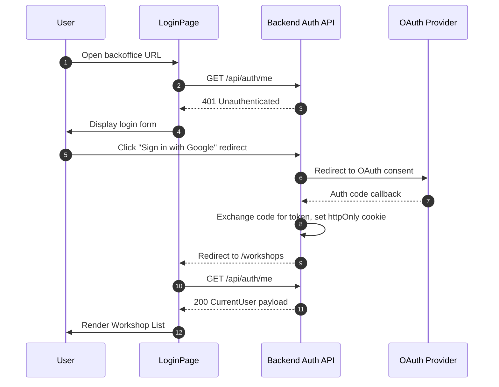
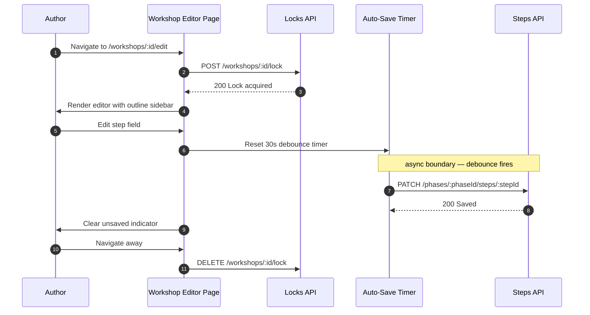
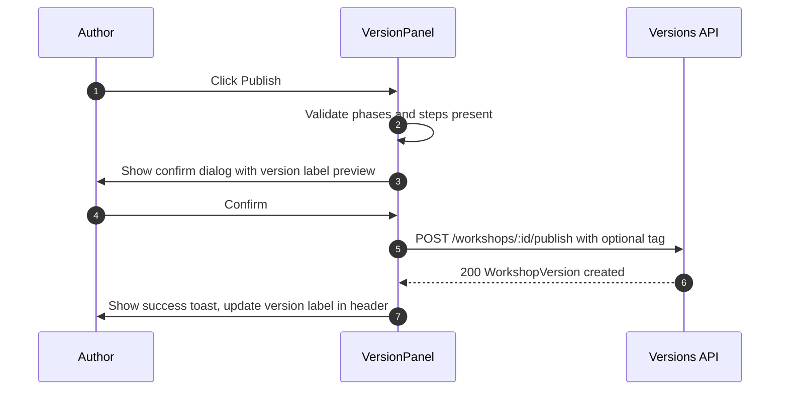
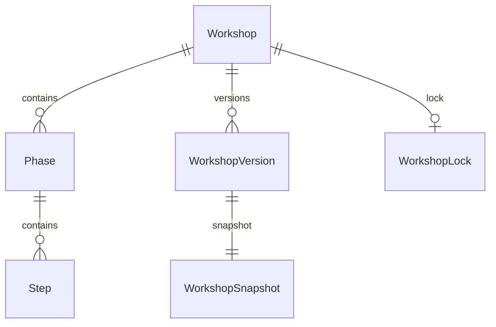
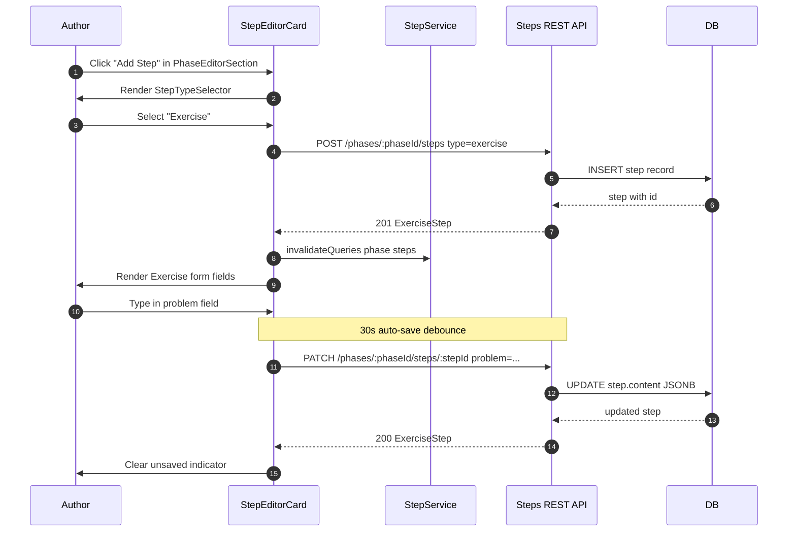

# Design Document — Backoffice Content Authoring

## Overview

The Backoffice Content Authoring feature is one of the two route trees inside the unified **Stageboard** frontend
application. Content Authors (who are also Trainers) use the `/backoffice` route tree to create, organise, version, and
publish workshop content. The `/frontoffice` route tree (a separate spec) delivers the same content to Trainers and
Participants at runtime.

The Stageboard frontend is a single Vite application with TanStack Router. Both route trees live in one build; the
`/backoffice` tree is auth-gated (httpOnly JWT cookie), while `/frontoffice` is publicly accessible. This replaces the
previous two-app model (`apps/backoffice` + `apps/spellbook`). Content is persisted via the backend REST API to
PostgreSQL.

The `/backoffice` route tree covers eight requirement areas: workshop CRUD, phase management, step management with five
typed forms, workshop versioning and publishing, pessimistic team locking, Markdown file import, and an outline
navigation sidebar.

### Goals

- Provide a complete CRUD interface for workshops, phases, and typed steps backed by a REST API.
- Enforce a draft/publish content lifecycle so live sessions always consume stable, versioned content.
- Prevent data loss via 30-second auto-save and pessimistic workshop-level locking.
- Support Markdown file import with editable mapping preview.
- Share domain types with the `/frontoffice` route tree via `src/data/` within the same app.

### Non-Goals

- Notion import (PRD Phase 3 — no stubs or UI in this spec).
- Real-time collaborative editing (concurrent access is blocked via pessimistic lock).
- Frontoffice (Trainer/Participant delivery views) — covered by the `/frontoffice` route tree spec.
- Backend API implementation (REST contracts are defined here as the interface; implementation is a separate backend
  spec).
- Mobile responsive layout (desktop browser only per NFR U-02).

---

## Architecture

### Existing Architecture Analysis

The legacy Spellbook SPA is a constraint-heavy static app (no router, no backend, no auth, static data files). Rather
than extending it, the Stageboard frontend supersedes it as a single unified app. The existing `Phase`/`Step` domain
types from `src/data/phases.ts` serve as the baseline; they are migrated and extended within `src/data/` of the new app.
The old `WorkflowContext` and `NotesContext` are reused for the `/frontoffice` route tree, eliminating the need for two
separate builds.

### Architecture Pattern & Boundary Map

The Stageboard frontend follows a **Layered SPA** pattern with route-tree isolation: Presentation → Service (TanStack
Query hooks) → API Client → REST backend. A single TanStack Router instance defines two top-level route trees —
`/backoffice` (auth-gated) and `/frontoffice` (public).

**Monorepo Directory Layout**

```
stageboard/
├── backend/                        # Spring Boot / Kotlin API
│   ├── src/
│   └── build.gradle.kts
├── frontend/                       # Single Vite + React app
│   ├── src/
│   │   ├── routes/
│   │   │   ├── __root.tsx          # Root layout (QueryClientProvider, RouterDevtools)
│   │   │   ├── backoffice/
│   │   │   │   ├── _auth.tsx       # Auth guard layout route (redirects to /backoffice/login)
│   │   │   │   ├── login.tsx
│   │   │   │   ├── workshops/
│   │   │   │   │   ├── index.tsx   # Workshop list
│   │   │   │   │   └── $id/
│   │   │   │   │       ├── edit.tsx
│   │   │   │   │       └── versions.tsx
│   │   │   │   └── import.tsx
│   │   │   └── frontoffice/
│   │   │       ├── index.tsx       # Delivery landing / workshop picker
│   │   │       └── $sessionCode/
│   │   │           ├── trainer.tsx
│   │   │           └── participant.tsx
│   │   ├── components/             # Shared + route-scoped UI components
│   │   ├── hooks/                  # Reusable stateful logic
│   │   ├── services/               # TanStack Query hooks + typed API client
│   │   ├── data/                   # Domain types (Phase, Step, Workshop, etc.)
│   │   ├── contexts/               # WorkflowContext, NotesContext (frontoffice)
│   │   └── main.tsx
│   ├── index.html
│   ├── vite.config.ts
│   └── package.json
├── pnpm-workspace.yaml
├── package.json                    # Workspace root (scripts, shared dev deps)
└── .mise.toml
```

**Architecture Boundary Map**

```mermaid
graph TB
    subgraph Monorepo
        subgraph Frontend [frontend/]
            subgraph Router [TanStack Router]
                BackofficeTree[/backoffice/* route tree\nauth-gated via _auth layout route]
                FrontofficeTree[/frontoffice/* route tree\npublic]
            end
            QueryCache[TanStack Query Cache]
            RestClient[REST API Client\ncredentials: include]
            DomainTypes[src/data/ — shared domain types]
        end
        subgraph Backend [backend/]
            SpringAPI[Spring Boot MVC API]
        end
    end
    subgraph BackendREST [REST Endpoints]
        AuthAPI[/api/auth/*]
        WorkshopsAPI[/api/workshops/*]
        PhasesAPI[/api/phases/*]
        StepsAPI[/api/steps/*]
        VersionsAPI[/api/versions/*]
        LocksAPI[/api/locks/*]
        ImportAPI[/api/import/*]
    end
    subgraph OAuthProviders
        Google[Google]
        GitHub[GitHub]
        XProvider[X / Twitter]
    end

    BackofficeTree --> QueryCache
    FrontofficeTree --> QueryCache
    QueryCache --> RestClient
    RestClient --> BackendREST
    BackendREST --> SpringAPI
    AuthAPI --> Google
    AuthAPI --> GitHub
    AuthAPI --> XProvider
    DomainTypes --> BackofficeTree
    DomainTypes --> FrontofficeTree
```

**Architecture Integration**:

- Selected pattern: Layered SPA with TanStack Router route trees — `/backoffice` and `/frontoffice` are co-located in
  one build, code-split at the route level via lazy imports, sharing the QueryClient and domain types.
- Auth boundary: TanStack Router `_auth` layout route (`beforeLoad` hook) guards all `/backoffice` routes; unauthenticated
  requests redirect to `/backoffice/login`. `/frontoffice` has no auth requirement.
- Domain types: `src/data/` holds `Workshop`, `Phase`, `Step` interfaces consumed by both route trees; no separate
  package needed.
- Existing patterns preserved: Tailwind v4 utility classes, JetBrains Mono aesthetic, TypeScript strict mode.
- Steering compliance: Tailwind v4 only, no CSS-in-JS, functional components, TypeScript strict mode.

### Technology Stack

| Layer              | Choice / Version                                        | Role in Feature                                            | Notes                                               |
|--------------------|---------------------------------------------------------|------------------------------------------------------------|-----------------------------------------------------|
| Frontend framework | React 19 + TypeScript 5.9                               | UI components and hooks for both route trees               | Single app; no class components                     |
| Bundler            | Vite 7 + @vitejs/plugin-react                           | Dev server, production build for unified `frontend/` app   | One entry point; route-level code splitting         |
| Styling            | Tailwind CSS v4 via @tailwindcss/vite                   | Utility-class UI across all routes                         | No config file; colours via `@theme` in `index.css` |
| Routing            | TanStack Router v1                                      | `/backoffice/*` (auth-gated) + `/frontoffice/*` (public)   | File-based routes in `src/routes/`; type-safe params |
| Server state       | TanStack Query v5                                       | Fetch, cache, mutate, auto-save                            | `QueryClientProvider` at `__root.tsx`               |
| Drag-and-drop      | @dnd-kit/core v6 + @dnd-kit/sortable v8                 | Phase + step reorder; cross-list drag                      | Backoffice route tree only                          |
| Markdown editor    | @uiw/react-codemirror v4 + @codemirror/lang-markdown    | Syntax-highlighted Markdown editing pane                   | CodeMirror 6; backoffice route tree only            |
| Markdown preview   | react-markdown v9 + remark-gfm v4 + rehype-highlight v7 | Live preview (backoffice) + step content rendering (frontoffice) | Shared component                              |
| Auth               | httpOnly cookie JWT (backend-issued)                    | Cookie-based session; guards `/backoffice/*` route tree    | `credentials: "include"` on all fetch calls         |
| HTTP client        | Native `fetch` (typed wrapper)                          | REST API calls from both route trees                       | No Axios; typed `apiClient` module in `src/services/` |
| Domain types       | `src/data/` in `frontend/`                              | `Workshop`, `Phase`, `Step` interfaces shared across trees | No separate workspace package needed                |
| Infrastructure     | mise + pnpm workspaces                                  | Toolchain consistency; `backend/` + `frontend/` workspaces | Single `pnpm-workspace.yaml` at monorepo root       |

---

## System Flows

### Authentication Flow



### Workshop Edit and Auto-Save Flow



### Publish Flow



---

## Requirements Traceability

| Requirement   | Summary                   | Components                                                      | Interfaces                                                     | Flows                 |
|---------------|---------------------------|-----------------------------------------------------------------|----------------------------------------------------------------|-----------------------|
| 1.1–1.6       | Workshop CRUD             | WorkshopListPage, WorkshopService                               | REST: GET/POST/PUT/DELETE /workshops                           | —                     |
| 2.1–2.6       | Phase management          | PhaseEditorSection, PhaseService                                | REST: POST/PUT/DELETE /workshops/:id/phases, PATCH order       | —                     |
| 3.1–3.7       | Step management           | StepEditorCard, StepService, DragSortableList                   | REST: POST/PUT/DELETE /phases/:id/steps, PATCH order           | —                     |
| 4.1–4.10      | Typed step content fields | StepEditorCard, MarkdownField, CodeBlockField, PollOptionsField | MarkdownFieldProps, CodeBlockFieldProps, PollOptionsFieldProps | —                     |
| 5.1–5.7       | Versioning and publishing | VersionPanel, VersionService                                    | REST: POST /publish, GET /versions                             | Publish Flow          |
| 6.1–6.5       | Team access and locking   | LockService, LockBanner, AuthGate                               | REST: GET/POST/DELETE /lock, GET /api/auth/me                  | Auth Flow             |
| 7.1–7.6       | Markdown import           | ImportModal, ImportService                                      | REST: POST /import/markdown                                    | —                     |
| 8.1–8.5       | Outline navigation        | OutlineSidebar                                                  | OutlineSidebarProps                                            | Edit + Auto-Save Flow |
| NFR S-01–S-04 | Security                  | AuthGate, RestClient, MarkdownField                             | httpOnly cookie; sanitised Markdown                            | Auth Flow             |
| NFR R-01      | Auto-save                 | useAutoSave hook, StepEditorCard                                | PATCH /steps/:id                                               | Edit Flow             |
| NFR P-02      | Preview latency           | MarkdownField (300 ms debounce)                                 | —                                                              | —                     |

---

## Components and Interfaces

### Summary Table

| Component          | Layer   | Intent                                                               | Req Coverage      | Key Dependencies                                | Contracts      |
|--------------------|---------|----------------------------------------------------------------------|-------------------|-------------------------------------------------|----------------|
| AuthGate           | Auth    | Protect all routes; derive auth state                                | 6.1–6.5, S-01     | RestClient (P0)                                 | Service, State |
| WorkshopListPage   | Page    | List, create, delete workshops                                       | 1.1–1.6           | WorkshopService (P0)                            | API            |
| WorkshopEditorPage | Page    | Compose editor; manage lock lifecycle                                | 2–5, 8            | LockService (P0), WorkshopService (P0)          | API, State     |
| OutlineSidebar     | UI      | Phase/step tree; scroll-to navigation                                | 8.1–8.5           | WorkshopEditorPage (P0)                         | State          |
| PhaseEditorSection | UI      | Phase title + duration fields + step list                            | 2.1–2.6           | PhaseService (P0), DragSortableList (P1)        | Service        |
| StepEditorCard     | UI      | Type-specific step form; local draft state                           | 3.1–3.7, 4.1–4.10 | useAutoSave (P0), MarkdownField (P1)            | Service, State |
| MarkdownField      | UI      | Split-pane Markdown editor + live preview                            | 4.6–4.7           | @uiw/react-codemirror (P0), react-markdown (P0) | —              |
| CodeBlockField     | UI      | Code editor + language selector                                      | 4.7–4.8           | @uiw/react-codemirror (P0)                      | —              |
| PollOptionsField   | UI      | Dynamic options list (2–8 items)                                     | 4.4, 4.9–4.10     | —                                               | —              |
| DragSortableList   | UI      | Sortable list wrapper (phases or steps)                              | 2.3, 3.3–3.4      | @dnd-kit/core (P0), @dnd-kit/sortable (P0)      | Service        |
| LockBanner         | UI      | Lock conflict notice (read-only mode)                                | 6.2, S-01         | LockService (P0)                                | State          |
| VersionPanel       | UI      | Publish, version history, restore                                    | 5.1–5.7           | VersionService (P0)                             | Service, API   |
| ImportModal        | UI      | Markdown file upload + mapping preview                               | 7.1–7.6           | ImportService (P0)                              | API            |
| RestClient         | Infra   | Typed fetch wrapper; auth cookies                                    | All               | —                                               | Service        |
| WorkshopService    | Service | TanStack Query hooks for workshop CRUD                               | 1.1–1.6           | RestClient (P0)                                 | API            |
| PhaseService       | Service | TanStack Query hooks for phase CRUD + reorder                        | 2.1–2.6           | RestClient (P0)                                 | API            |
| StepService        | Service | TanStack Query hooks for step CRUD + reorder                         | 3.1–3.7           | RestClient (P0)                                 | API            |
| VersionService     | Service | Publish, list, restore version hooks                                 | 5.1–5.7           | RestClient (P0)                                 | API            |
| LockService        | Service | Acquire, heartbeat, release lock hooks                               | 6.1–6.5           | RestClient (P0)                                 | API            |
| ImportService      | Service | Upload file, parse preview, confirm import                           | 7.1–7.6           | RestClient (P0)                                 | API            |
| useAutoSave        | Hook    | Debounced 30s PATCH for both steps and phases; accepts resource type | NFR R-01, 2.2     | StepService (P0), PhaseService (P0)             | Service        |

---

### Authentication Layer

#### AuthGate

| Field        | Detail                                                                                             |
|--------------|----------------------------------------------------------------------------------------------------|
| Intent       | Wraps the entire app; redirects unauthenticated users to login; provides `CurrentUser` via context |
| Requirements | 6.1, 6.5, S-01                                                                                     |

**Responsibilities & Constraints**

- On mount: calls `GET /api/auth/me`; if 401, redirects to `/login`.
- Provides `CurrentUserContext` (user id, name, teamId) consumed by all child components.
- All fetch calls use `credentials: "include"` (httpOnly JWT cookie).

**Dependencies**

- Outbound: RestClient — auth state check (P0)
- External: Backend Auth API — `GET /api/auth/me`, `POST /api/auth/logout` (P0)

**Contracts**: Service [x] / State [x]

##### Service Interface

```typescript
interface CurrentUser {
  id: string;
  name: string;
  email: string;
  teamId: string;
}

interface AuthService {
  getCurrentUser(): Promise<CurrentUser>;

  logout(): Promise<void>;
}
```

**Implementation Notes**

- Integration: Auth state loaded once at app root via `useQuery(["auth/me"])`. Cache TTL 5 min; refetch on window focus.
- Validation: 401 on any request → clear cache + redirect to `/login`.
- Risks: httpOnly cookie requires CORS `credentials: "include"` + backend `Access-Control-Allow-Credentials: true`.

---

### Infrastructure Layer

#### RestClient

| Field        | Detail                                                                                           |
|--------------|--------------------------------------------------------------------------------------------------|
| Intent       | Typed `fetch` wrapper; injects `credentials: "include"`, handles 401 redirect, normalises errors |
| Requirements | All                                                                                              |

**Contracts**: Service [x]

##### Service Interface

```typescript
type ApiResult<T> =
  | { ok: true; data: T }
  | { ok: false; status: number; message: string };

interface RestClient {
  get<T>(path: string): Promise<ApiResult<T>>;

  post<T, B>(path: string, body: B): Promise<ApiResult<T>>;

  put<T, B>(path: string, body: B): Promise<ApiResult<T>>;

  patch<T, B>(path: string, body: Partial<B>): Promise<ApiResult<T>>;

  delete(path: string): Promise<ApiResult<void>>;

  upload<T>(path: string, form: FormData): Promise<ApiResult<T>>;
}
```

- Preconditions: All calls include `credentials: "include"`. Responses are JSON.
- Postconditions: Returns typed `ApiResult<T>`; never throws. 401 → fires global auth-expired event.
- Invariants: Base URL is read from `import.meta.env.VITE_API_BASE_URL`.

---

### Workshop Management Layer

#### WorkshopService

| Field        | Detail                                                                 |
|--------------|------------------------------------------------------------------------|
| Intent       | TanStack Query hooks for workshop list, detail, create, update, delete |
| Requirements | 1.1–1.6                                                                |

**Contracts**: Service [x] / API [x]

##### Service Interface

```typescript
interface WorkshopService {
  useWorkshops(): UseQueryResult<Workshop[]>;

  useWorkshop(id: string): UseQueryResult<Workshop>;

  useCreateWorkshop(): UseMutationResult<Workshop, ApiError, CreateWorkshopInput>;

  useUpdateWorkshop(): UseMutationResult<Workshop, ApiError, UpdateWorkshopInput>;

  useDeleteWorkshop(): UseMutationResult<void, ApiError, string>;
}

interface CreateWorkshopInput {
  title: string;
}

interface UpdateWorkshopInput {
  id: string;
  title?: string;
}
```

##### API Contract

| Method | Endpoint           | Request               | Response     | Errors             |
|--------|--------------------|-----------------------|--------------|--------------------|
| GET    | /api/workshops     | —                     | `Workshop[]` | 401                |
| POST   | /api/workshops     | `CreateWorkshopInput` | `Workshop`   | 400, 401           |
| GET    | /api/workshops/:id | —                     | `Workshop`   | 401, 403, 404      |
| PUT    | /api/workshops/:id | `UpdateWorkshopInput` | `Workshop`   | 400, 401, 403, 404 |
| DELETE | /api/workshops/:id | —                     | 204          | 401, 403, 404      |

**Implementation Notes**

- Integration: `onSuccess` of create → navigate to editor; `onSuccess` of delete → invalidate `["workshops"]`.
- Validation: Title required; enforced client-side before mutation fires.
- Risks: Delete is irreversible; confirmation modal must be presented (Req 1.4).

---

### Phase & Step Service Layer

#### PhaseService

| Field        | Detail                                                   |
|--------------|----------------------------------------------------------|
| Intent       | TanStack Query hooks for phase CRUD and position reorder |
| Requirements | 2.1–2.6                                                  |

**Contracts**: Service [x] / API [x]

##### API Contract

| Method | Endpoint                           | Request                         | Response | Errors        |
|--------|------------------------------------|---------------------------------|----------|---------------|
| POST   | /api/workshops/:id/phases          | `{ title, estimatedMinutes }`   | `Phase`  | 400, 401, 403 |
| PUT    | /api/workshops/:id/phases/:phaseId | `{ title?, estimatedMinutes? }` | `Phase`  | 400, 401, 403 |
| DELETE | /api/workshops/:id/phases/:phaseId | —                               | 204      | 401, 403, 404 |
| PATCH  | /api/workshops/:id/phases/order    | `{ orderedIds: string[] }`      | 200      | 400, 401, 403 |

#### StepService

| Field        | Detail                                                  |
|--------------|---------------------------------------------------------|
| Intent       | TanStack Query hooks for step CRUD and position reorder |
| Requirements | 3.1–3.7                                                 |

**Contracts**: Service [x] / API [x]

##### API Contract

| Method | Endpoint                                | Request                                       | Response | Errors        |
|--------|-----------------------------------------|-----------------------------------------------|----------|---------------|
| POST   | /api/phases/:phaseId/steps              | `CreateStepInput`                             | `Step`   | 400, 401, 403 |
| PATCH  | /api/phases/:phaseId/steps/:stepId      | `StepUpdatePayload`                           | `Step`   | 400, 401, 403 |
| DELETE | /api/phases/:phaseId/steps/:stepId      | —                                             | 204      | 401, 403, 404 |
| PATCH  | /api/phases/:phaseId/steps/order        | `{ orderedIds: string[] }`                    | 200      | 400, 401, 403 |
| PATCH  | /api/phases/:phaseId/steps/:stepId/move | `{ targetPhaseId: string; position: number }` | `Step`   | 400, 401, 403 |

---

### Lock Management

#### LockService

| Field        | Detail                                                      |
|--------------|-------------------------------------------------------------|
| Intent       | Acquire, heartbeat, release workshop-level pessimistic lock |
| Requirements | 6.2, NFR R-01                                               |

**Contracts**: Service [x] / API [x]

##### Service Interface

```typescript
type LockStatus =
  | { held: true }
  | { held: false; lockedBy: string; lockedAt: string };

interface LockService {
  acquireLock(workshopId: string): Promise<LockStatus>;

  releaseLock(workshopId: string): Promise<void>;

  startHeartbeat(workshopId: string): () => void; // returns cleanup fn
}
```

##### API Contract

| Method | Endpoint                | Request | Response         | Errors                       |
|--------|-------------------------|---------|------------------|------------------------------|
| POST   | /api/workshops/:id/lock | —       | `{ held: true }` | 409 `{ lockedBy, lockedAt }` |
| PUT    | /api/workshops/:id/lock | —       | 200              | 409, 404                     |
| DELETE | /api/workshops/:id/lock | —       | 204              | 401, 403                     |

**Implementation Notes**

- Integration: `WorkshopEditorPage` calls `acquireLock` on mount. On 409, renders `LockBanner` in read-only mode.
  `startHeartbeat` sets `setInterval(60 000)` and returns cleanup for `useEffect`.
- Risks: `beforeunload` `DELETE /lock` is best-effort (browser may not complete fetch). Server-side TTL = 120 s prevents
  indefinite locks.

---

### Version Management

#### VersionService

| Field        | Detail                                                           |
|--------------|------------------------------------------------------------------|
| Intent       | Publish workshop, list version history, restore version to draft |
| Requirements | 5.1–5.7                                                          |

**Contracts**: Service [x] / API [x]

##### Service Interface

```typescript
interface VersionService {
  useVersions(workshopId: string): UseQueryResult<WorkshopVersion[]>;

  usePublish(): UseMutationResult<WorkshopVersion, ApiError, PublishInput>;

  useRestore(): UseMutationResult<void, ApiError, RestoreInput>;
}

interface PublishInput {
  workshopId: string;
  tag?: string; // optional user-defined label e.g. "Spring 2026"
}

interface RestoreInput {
  workshopId: string;
  versionId: string;
}
```

##### API Contract

| Method | Endpoint                                       | Request            | Response            | Errors             |
|--------|------------------------------------------------|--------------------|---------------------|--------------------|
| POST   | /api/workshops/:id/publish                     | `{ tag?: string }` | `WorkshopVersion`   | 400, 401, 403, 422 |
| GET    | /api/workshops/:id/versions                    | —                  | `WorkshopVersion[]` | 401, 403           |
| POST   | /api/workshops/:id/versions/:versionId/restore | —                  | 200                 | 401, 403, 404      |

**Implementation Notes**

- Validation: Client-side guard — if workshop has 0 phases or any phase has 0 steps, show confirmation warning (Req
  5.7).
- Atomicity: Backend must publish within a database transaction; 422 on validation failure.

---

### Import

#### ImportService

| Field        | Detail                                                        |
|--------------|---------------------------------------------------------------|
| Intent       | Upload Markdown file, receive mapping preview, confirm import |
| Requirements | 7.1–7.6                                                       |

**Contracts**: Service [x] / API [x]

##### API Contract

| Method | Endpoint                                   | Request                   | Response        | Errors             |
|--------|--------------------------------------------|---------------------------|-----------------|--------------------|
| POST   | /api/workshops/:id/import/markdown         | `FormData { file: File }` | `ImportPreview` | 400, 413, 415, 422 |
| POST   | /api/workshops/:id/import/markdown/confirm | `ConfirmImportInput`      | `Workshop`      | 400, 401, 403      |

```typescript
interface ImportPreview {
  phases: ImportPhasePreview[];
}

interface ImportPhasePreview {
  suggestedTitle: string;
  steps: ImportStepPreview[];
  action: "include" | "skip"; // author can change
}

interface ImportStepPreview {
  suggestedTitle: string;
  type: "theory"; // all imports default to Theory
  content: string; // raw Markdown
  action: "include" | "skip";
}

interface ConfirmImportInput {
  phases: Array<{
    title: string;
    action: "include" | "skip";
    steps: Array<{ title: string; action: "include" | "skip" }>;
  }>;
}
```

**Implementation Notes**

- Validation: File size > 5 MB → reject before upload. MIME type must be `text/markdown` or `text/plain`.
- Base64 images: backend extracts, uploads to asset store, rewrites to hosted URLs before returning preview content.
- Risks: Large Markdown files with many images can cause slow preview load; show spinner during `POST /import/markdown`.

---

### Editor UI Components

#### DragSortableList

| Field        | Detail                                                                                  |
|--------------|-----------------------------------------------------------------------------------------|
| Intent       | Generic accessible sortable list using @dnd-kit; used for both phase list and step list |
| Requirements | 2.3, 3.3–3.4                                                                            |

**Contracts**: Service [x]

##### Service Interface

```typescript
interface DragSortableListProps<T extends { id: string }> {
  items: T[];
  onReorder: (orderedIds: string[]) => void;
  renderItem: (item: T, isDragging: boolean) => React.ReactNode;
  axis?: "vertical" | "horizontal";
}
```

**Implementation Notes**

- `DndContext` is owned by `WorkshopEditorPage` and wraps the entire editor surface — both the `OutlineSidebar` and the
  `EditorPane` (including all `PhaseEditorSection` / step lists). This single context is required for cross-phase step
  drag (Req 3.4) and ensures `OutlineSidebar` receives drag events from the same source.
- **State ownership during drag**: `WorkshopEditorPage` holds
  `optimisticOrder: { phases: Phase[]; stepsByPhase: Record<string, Step[]> }` in `useState`. This local state is the
  single source of order truth during an active drag. Both `OutlineSidebar` and `EditorPane` read from
  `optimisticOrder`, not from the TanStack Query cache, while a drag is in progress. This prevents the sidebar flashing
  stale order (Req 8.3).
- **On `onDragEnd`**: `optimisticOrder` is updated first (instant UI), then the appropriate PATCH (`/phases/order` or
  `/steps/order` or `/steps/:id/move`) is fired. On PATCH success, `queryClient.invalidateQueries` syncs the cache; on
  failure, `optimisticOrder` reverts to the previous cache state and a toast error is shown.
- `onReorder` fires `PhaseService.reorderPhases` or `StepService.reorderSteps` (or `moveStep` for cross-phase).

#### MarkdownField

| Field        | Detail                                                       |
|--------------|--------------------------------------------------------------|
| Intent       | Split-pane CodeMirror 6 editor + react-markdown live preview |
| Requirements | 4.6–4.7                                                      |

##### Service Interface

```typescript
interface MarkdownFieldProps {
  value: string;
  onChange: (value: string) => void;
  label: string;
  placeholder?: string;
  previewDebounceMs?: number; // default 300
}
```

**Implementation Notes**

- Preview rendered via `react-markdown` with `remark-gfm` and `rehype-highlight`. Debounced 300 ms.
- Markdown is rendered inside a sandboxed div; `rehype-sanitize` applied before `rehype-highlight` to prevent XSS (NFR
  S-03).

#### StepEditorCard

| Field        | Detail                                                                                     |
|--------------|--------------------------------------------------------------------------------------------|
| Intent       | Renders the type-specific form for one step; manages local draft state; triggers auto-save |
| Requirements | 3.1–3.7, 4.1–4.10                                                                          |

**Contracts**: Service [x] / State [x]

##### State Management

- State model: `localDraft: Partial<Step>` — field values edited but not yet auto-saved. Initialised from server data on
  mount.
- Persistence: `useAutoSave(localDraft, stepId, phaseId)` debounces 30 s PATCH. Unsaved indicator shown while
  `localDraft !== savedStep`.
- Concurrency strategy: Single editor only (pessimistic lock on parent workshop).

#### useAutoSave (Hook)

| Field        | Detail                                                                                                        |
|--------------|---------------------------------------------------------------------------------------------------------------|
| Intent       | Generic debounced 30 s auto-save hook; covers both step fields and phase fields to satisfy NFR R-01 uniformly |
| Requirements | NFR R-01, 2.2, 3.1                                                                                            |

**Contracts**: Service [x]

##### Service Interface

```typescript
type AutoSaveResource =
  | { kind: "step"; phaseId: string; stepId: string; payload: StepUpdatePayload }
  | { kind: "phase"; workshopId: string; phaseId: string; payload: PhaseUpdatePayload };

interface PhaseUpdatePayload {
  title?: string;
  estimatedMinutes?: number;
}

interface UseAutoSaveOptions {
  resource: AutoSaveResource;
  enabled: boolean;       // false when no unsaved changes
  debounceMs?: number;    // default 30 000
  onSuccess?: () => void;
  onError?: (attempt: number) => void; // attempt 1-3; on 3 show persistent banner
}

function useAutoSave(options: UseAutoSaveOptions): { saving: boolean; failed: boolean };
```

- Preconditions: `enabled` is true only when `localDraft` differs from the last saved server value.
- Postconditions: On success, `enabled` resets to false and `onSuccess` fires. On three consecutive failures, `failed`
  is set to true and a persistent banner is shown.
- Invariants: At most one in-flight PATCH per resource at a time; a new debounce window cancels the pending timer.

**Implementation Notes**

- `PhaseEditorSection` calls `useAutoSave` with `kind: "phase"` on every title/duration change, replacing the "on blur"
  save pattern. On-blur still triggers an immediate flush of the debounce as a UX affordance, but auto-save is the
  persistence guarantee.
- `StepEditorCard` continues to call `useAutoSave` with `kind: "step"`.
- Both share the same 30 s debounce and retry logic; the hook internally routes to `PhaseService.updatePhase` or
  `StepService.updateStep` based on `kind`.

---

## Data Models

### Domain Model

**Aggregates**:

- `Workshop` — aggregate root. Owns `Phase[]`. Controls publish/version lifecycle. Lock is scoped to Workshop.
- `Phase` — owned by Workshop. Owns `Step[]`. Position is explicit (`position: number`).
- `Step` — owned by Phase. Typed discriminated union by `StepType`. Position is explicit.
- `WorkshopVersion` — immutable snapshot created at publish. Not an aggregate; never mutated post-creation.
- `WorkshopLock` — transient value object. TTL-bound, not versioned.

**Business Invariants**:

- A Workshop cannot be published without at least one Phase, and every Phase must contain at least one Step.
- A WorkshopLock is held by exactly one user at a time; TTL = 120 s.
- Step position values within a Phase form a gapless sequence starting at 0.
- A WorkshopVersion snapshot is immutable; restoring creates a new draft, not a mutation of the version.



### Logical Data Model

```typescript
// packages/shared-types/src/index.ts

export type StepType = "theory" | "exercise" | "demo" | "poll" | "break";

export interface Workshop {
  id: string;
  title: string;
  teamId: string;
  currentVersionLabel: string | null;   // null = never published
  currentVersionTag: string | null;
  draftModifiedAt: string;              // ISO 8601
  lastEditorId: string;
  lastEditorName: string;
  lockedBy: string | null;             // user name if locked, null if free
  phases: Phase[];
}

export interface Phase {
  id: string;
  workshopId: string;
  title: string;
  estimatedMinutes: number;
  position: number;
  steps: Step[];
}

export type Step = TheoryStep | ExerciseStep | DemoStep | PollStep | BreakStep;

interface BaseStep {
  id: string;
  phaseId: string;
  title: string;
  position: number;
  speakerNotes?: string;
}

export interface TheoryStep extends BaseStep {
  type: "theory";
  detail?: string;
  code?: string;
  codeLanguage?: string;
}

export interface ExerciseStep extends BaseStep {
  type: "exercise";
  problem?: string;
  solution?: string;
  code?: string;
  codeLanguage?: string;
}

export interface DemoStep extends BaseStep {
  type: "demo";
}

export interface PollStep extends BaseStep {
  type: "poll";
  question?: string;
  options: string[];           // min 2, max 8
}

export interface BreakStep extends BaseStep {
  type: "break";
  durationMinutes?: number;
  message?: string;
}

// Discriminated update payload — used for PATCH /steps/:id and useAutoSave
export type StepUpdatePayload =
  | {
  type: "theory";
  title?: string;
  detail?: string;
  code?: string;
  codeLanguage?: string;
  speakerNotes?: string
}
  | {
  type: "exercise";
  title?: string;
  problem?: string;
  solution?: string;
  code?: string;
  codeLanguage?: string;
  speakerNotes?: string
}
  | { type: "demo"; title?: string; speakerNotes?: string }
  | { type: "poll"; title?: string; question?: string; options?: string[] }
  | { type: "break"; title?: string; durationMinutes?: number; message?: string };

export interface WorkshopVersion {
  id: string;
  workshopId: string;
  versionLabel: string;        // e.g. "1.0", "1.1"
  versionTag: string | null;   // e.g. "Spring 2026"
  publishedAt: string;         // ISO 8601
  publishedByName: string;
}
```

### Physical Data Model

The backend persists to PostgreSQL. Full schema is in the backend specification; key tables relevant to frontend API
contracts:

| Table               | Key Columns                                                                           | Notes                         |
|---------------------|---------------------------------------------------------------------------------------|-------------------------------|
| `workshops`         | `id`, `title`, `team_id`, `last_editor_id`, `draft_modified_at`                       | Draft state                   |
| `phases`            | `id`, `workshop_id`, `title`, `estimated_minutes`, `position`                         | Gapless position              |
| `steps`             | `id`, `phase_id`, `type`, `title`, `position`, `content JSONB`                        | Type-specific fields in JSONB |
| `workshop_versions` | `id`, `workshop_id`, `version_label`, `version_tag`, `snapshot JSONB`, `published_at` | Immutable                     |
| `workshop_locks`    | `workshop_id PK`, `locked_by_id`, `locked_at`, `expires_at`                           | TTL enforced by query         |

---

## Error Handling

### Error Strategy

All user-facing errors follow **Fail Fast + Graceful Degradation**: validate client-side first, display field-level
errors immediately; surface server errors as toast notifications without blocking the editor.

### Error Categories and Responses

**User Errors (4xx)**

- `400` Invalid input → inline field validation error; no toast.
- `401` Unauthenticated → clear QueryClient cache; redirect to `/login`.
- `403` Forbidden → show access-denied message; do not expose team data.
- `404` Resource not found → navigate to workshop list with "Workshop not found" message.
- `409` Lock conflict → render `LockBanner` with `lockedBy` name; set editor to read-only.
- `413` File too large → ImportModal displays "File exceeds 5 MB limit" inline.

**System Errors (5xx)**

- `500/503` → toast "Something went wrong. Your changes are saved locally. Retry or contact support."
- Auto-save failure → increment retry counter (max 3); on third failure, show persistent banner "Auto-save failed —
  please save manually."

**Business Logic Errors (422)**

- Publish with empty phase → `VersionPanel` shows confirmation warning (Req 5.7); not blocked, but explicit user
  confirmation required.
- Poll with < 2 options → inline error on `PollOptionsField`; `StepEditorCard` disables save.

### Monitoring

- All `apiClient` errors logged to browser console with endpoint + status + timestamp.
- Failed auto-saves emit a custom `CustomEvent("autosave-failed")` at `window` level for future observability
  integration.

---

## Testing Strategy

### Unit Tests

- `RestClient` — test `get`, `post`, `patch`, `delete` with mocked `fetch`; verify 401 redirect, error envelope
  normalisation.
- `useAutoSave` — test debounce fires after 30 s; verify mutation called once per debounce window; verify retry logic on
  failure.
- `MarkdownField` — test preview debounce (300 ms); verify XSS sanitisation removes `<script>` tags from preview output.
- `PollOptionsField` — test minimum 2 / maximum 8 validation; verify add-option focuses new input.
- `DragSortableList` — test `onReorder` called with correct ordered IDs after drag simulation.

### Integration Tests

- Workshop CRUD flow: create → edit title → delete; verify list updates after each mutation.
- Lock lifecycle: acquire → heartbeat → navigate away → release; verify editor renders `LockBanner` on 409.
- Version publish: validate empty-phase guard → confirm → verify `WorkshopVersion` appears in version history.
- Markdown import: upload file → check preview mapping → confirm → verify phases and steps appended to workshop.
- Auth guard: unauthenticated `GET /api/auth/me` → verify redirect to `/login`; authenticated → verify list renders.

### E2E Tests

- Full authoring loop: login → create workshop → add phase → add Theory step → edit Markdown → verify auto-save
  indicator clears.
- Cross-phase drag: drag step from phase 1 to phase 2 → verify step appears in correct position in both phases.
- Publish and restore: publish v1.0 → edit draft → publish v1.1 → restore v1.0 → verify draft content reverts.
- Import: upload Markdown fixture → review mapping → rename a phase → confirm → verify workshop structure.

### Performance Tests

- Render workshop with 20 phases × 30 steps in outline sidebar — measure initial render < 2 s.
- Markdown preview update latency — keystroke to preview refresh < 200 ms (measured via `performance.now()`).
- Drag-and-drop reorder PATCH round-trip — measure < 500 ms on local dev server.

---

## Security Considerations

- **Auth (S-01)**: All routes wrapped in `AuthGate`. `GET /api/auth/me` on every app load. Cookie-based JWT (httpOnly,
  SameSite=Strict); no token in `localStorage`.
- **Team isolation (S-02)**: All API endpoints are scoped to the authenticated user's `teamId` server-side. Frontend
  relies on 403 for access-denied; does not attempt client-side filtering.
- **XSS via Markdown (S-03)**: `rehype-sanitize` applied before `rehype-highlight` in `MarkdownField` preview rendering.
  User-authored Markdown never injected as raw HTML.
- **File upload (S-04)**: Client-side check: reject files > 5 MB before upload. MIME type validated server-side (not
  trusted from `file.type`). Base64 image extraction done server-side.
- **CSRF**: Cookie-based auth with `SameSite=Strict` provides CSRF protection for same-origin requests. Cross-origin
  mutations require an explicit `Origin` header check server-side.
- **Token expiry mid-operation**: `RestClient` catches 401 on any request; fires global event to redirect to login.
  In-flight mutations are abandoned; auto-save will reattempt on re-login.

---

## Performance & Scalability

- **Outline sidebar virtualisation (SC-02)**: For workshops with > 20 phases × 30 steps (600 items), the
  `OutlineSidebar` uses windowed rendering via CSS `content-visibility: auto` on step rows; full virtualisation (e.g.
  `@tanstack/virtual`) deferred to post-MVP if benchmarks show regression.
- **TanStack Query cache (P-01)**: Workshop detail cached for 5 min; step list cached per phase. Editor navigating
  between steps does not re-fetch.
- **Auto-save debounce (R-01)**: 30 s debounce on field `onChange` prevents API flood during rapid typing.
- **Markdown preview debounce (P-02)**: 300 ms debounce on editor `onChange` before re-rendering preview.
- **Reorder batching**: PATCH `/order` sends the full ordered ID array; backend applies in a single transaction. No
  per-item PATCH on drag.

---

## Architecture Options Considered

### Option 1: pnpm Workspace Monorepo (Selected)

`apps/spellbook` + `apps/backoffice` as separate Vite applications; shared TypeScript types in `packages/shared-types`.

**Advantages:**

- Preserves Spellbook constraints exactly (no router, no auth, no backend) — zero risk to existing delivery app.
- Shared types (`Workshop`, `Phase`, `Step`) enforced at compile-time across both apps; drift between authoring and
  delivery data models is caught by `tsc`.
- Single pnpm install, single CI pipeline, shared mise toolchain and lint rules — consistent developer experience.

**Disadvantages:**

- One-time migration cost: existing `package.json` becomes a workspace root; Spellbook moves to `apps/spellbook`; CI
  scripts must be updated.
- Slightly longer initial `pnpm install` due to two app dependency trees (measured ~15 s additional on cold install).
- Workspace configuration (`pnpm-workspace.yaml`, root `tsconfig.json`) is new infra for the team to understand.

---

### Option 2: Embed in Existing Spellbook SPA

Add routing and auth to the existing Spellbook app; backoffice as a new "view".

**Advantages:**

- Zero repo migration; single build artefact.
- Shared components (e.g. `CodeBlock`) reused without a workspace.
- Single deployment URL.

**Disadvantages:**

- Directly violates `CLAUDE.md` constraints ("Never add a router"); requires `@tanstack/router` or React Router,
  permanently coupling delivery and authoring bundles.
- Authoring code (Markdown editor, DnD, TanStack Query) bundled into the delivery SPA, increasing participant page load
  by an estimated 150–200 kB gzipped.
- Auth layer (JWT, login page) would be visible to delivery-view users with no benefit — security surface increases with
  no gain.

---

### Option 3: Standalone Separate Repository

Brand-new repository for the backoffice with no connection to Spellbook.

**Advantages:**

- Maximum isolation — changes to backoffice cannot affect Spellbook.
- Independent release cycle and CI pipeline.
- Onboarding new team members to one repo is simpler if team specialises.

**Disadvantages:**

- `Workshop`, `Phase`, `Step` types must be duplicated or published as an npm package; type drift between delivery and
  authoring becomes a real risk.
- Duplicates mise setup, ESLint config, Tailwind config, Vite config — maintenance overhead estimated at 2× for tooling
  changes.
- No shared CI optimisation; both repos must be opened for cross-cutting changes (e.g. Step type addition requires PRs
  in two repos).

**Recommendation:** Option 1 (pnpm Workspace Monorepo) — the monorepo migration cost is a one-time 2–4 h investment; the
benefits (shared types, single CI, constraint preservation) compound over the life of the project.

---

## Architecture Decision Record

See: `.kiro/specs/backoffice-content-authoring/adr-001-monorepo-architecture.md`

- **Status**: Proposed
- **Context**: The backoffice requires routing, auth, and TanStack Query — all prohibited or absent in the existing
  Spellbook SPA. A new application boundary is required. The team currently has a single Vite SPA in the repository
  root.
- **Decision**: Convert the repository to a pnpm workspace monorepo with `apps/spellbook` and `apps/backoffice` as
  separate Vite applications; extract shared TypeScript domain types to `packages/shared-types`.
- **Consequences**:
    - ✔ Spellbook delivery SPA remains unchanged; no constraint violations; existing CI continues to work after script
      path updates.
    - ✔ `Workshop`, `Phase`, `Step` type changes are caught at compile-time in both apps simultaneously; no manual sync.
    - ✔ Each app can evolve its own dependency tree (backoffice can add TanStack Router without affecting Spellbook).
    - ✘ One-time migration moves `src/`, `package.json`, and Vite config under `apps/spellbook/`; CI environment
      variables referencing the root must be updated.
    - ✘ `pnpm install` duration increases by ~15 s on cold cache due to two app dependency trees.
- **Alternatives**:
    - Embed in Spellbook — rejected: violates no-router constraint; increases delivery bundle by ~200 kB.
    - Standalone repo — rejected: type duplication risk; 2× tooling maintenance.
- **References**: `.kiro/specs/backoffice-content-authoring/requirements.md`, NFR C-01, `.kiro/steering/tech.md`,
  `CLAUDE.md`

---

## Corner Cases

### Input Boundary Cases

| Scenario                                        | Expected Behaviour                                                      | Req  |
|-------------------------------------------------|-------------------------------------------------------------------------|------|
| Workshop title is empty string on submit        | `WorkshopListPage` shows inline validation error; POST not fired        | 1.5  |
| Phase `estimatedMinutes` = 0 or negative        | `PhaseEditorSection` shows validation error; value reverts on blur      | 2.5  |
| Step title is empty on save                     | `StepEditorCard` disables save; inline error shown                      | 3.7  |
| Poll step submitted with 1 option               | Inline error on `PollOptionsField`; PATCH blocked                       | 4.10 |
| Markdown field with `<script>alert(1)</script>` | `rehype-sanitize` strips tag; preview renders safely                    | S-03 |
| Markdown file > 5 MB uploaded                   | Rejected client-side before upload; error shown in `ImportModal`        | 7.5  |
| Workshop publish with 0 phases                  | `VersionPanel` shows confirmation warning; user must explicitly confirm | 5.7  |
| Version tag > 255 characters                    | Backend returns 400; `VersionPanel` shows inline error                  | 5.2  |

### State & Timing Edge Cases

| Scenario                                            | Expected Behaviour                                                                                                           | Req  |
|-----------------------------------------------------|------------------------------------------------------------------------------------------------------------------------------|------|
| Auto-save fires while user is mid-keystroke         | Debounce resets; save sent only after 30 s of inactivity                                                                     | R-01 |
| Lock heartbeat fails (network timeout)              | Retry once; on second failure show "Lock connection lost" banner; block further edits                                        | 6.2  |
| User navigates away before auto-save completes      | `useEffect` cleanup cancels pending debounce; navigation proceeds; partial change may be lost (max 30 s window per NFR R-01) | R-01 |
| Lock TTL expires while editor open                  | Next heartbeat returns 409; `LockService` shows "Lock expired" banner; editor becomes read-only                              | 6.2  |
| Drag-and-drop drop target phase deleted during drag | `onDragEnd` resolves to unknown phase ID; PATCH `/move` returns 404; toast error; UI reverts to last known state             | 3.4  |
| Publish triggered concurrently by two team members  | Second POST returns 409 (lock or concurrent publish conflict); `VersionPanel` shows error; first publish succeeds            | 5.2  |

### Integration Failure Modes

| Dependency                          | Failure Mode                            | Expected Behaviour                                                                               |
|-------------------------------------|-----------------------------------------|--------------------------------------------------------------------------------------------------|
| REST API unavailable                | All queries fail with network error     | Toast "Cannot connect to server"; retry button on workshop list; auto-save queued locally        |
| `POST /lock` times out              | `acquireLock` rejects                   | Editor renders in read-only mode as a safety fallback; user sees "Could not acquire lock" notice |
| `DELETE /lock` (on navigate) fails  | `beforeunload` fetch is fire-and-forget | Server TTL (120 s) releases lock automatically; no user action needed                            |
| `POST /import/markdown` returns 422 | Backend could not parse file structure  | `ImportModal` shows "Import failed: [server message]" inline                                     |
| OAuth provider unreachable          | Backend redirect to OAuth fails         | Backend returns 502; user sees "Login service unavailable, try again" on login page              |

### Security Edge Cases

| Scenario                                                                   | Expected Behaviour                                                                       |
|----------------------------------------------------------------------------|------------------------------------------------------------------------------------------|
| 401 received mid-session (token expired)                                   | `RestClient` fires `auth-expired` event → `AuthGate` clears cache → redirect to `/login` |
| User manually navigates to `/workshops/:id/edit` belonging to another team | REST API returns 403; `WorkshopEditorPage` renders access-denied message                 |
| XSS via crafted Markdown in import preview                                 | `rehype-sanitize` applied to all rendered preview content including imported content     |
| Concurrent POST `/publish` from same account (two browser tabs)            | Server lock prevents second publish mid-transaction; 409 returned to second tab          |

### Data Edge Cases

| Scenario                                                                | Expected Behaviour                                                                                                                            |
|-------------------------------------------------------------------------|-----------------------------------------------------------------------------------------------------------------------------------------------|
| Step type changed after content was filled                              | `StepEditorCard` clears type-specific fields (e.g. `options` cleared when switching from Poll to Theory); backend nullifies orphaned columns  |
| Workshop restored to previous version overwrites current draft          | `VersionPanel` warns "This will replace your current draft"; requires confirmation                                                            |
| Markdown import file with 100+ H2 headings (100 phases)                 | Preview renders all 100 phases in `ImportModal`; author can scroll and skip; PATCH bulk insert must succeed without timeout (backend concern) |
| 10× team size load (200 workshops × 20 phases × 30 steps per page load) | Workshop list paginates (server-side, 20 per page); editor loads single workshop; outline sidebar uses `content-visibility: auto`             |

---

## Sequence Diagram

The primary sequence is Workshop Edit with Auto-Save (see System Flows above). The sequence below shows the complete
new-step creation sub-flow.


